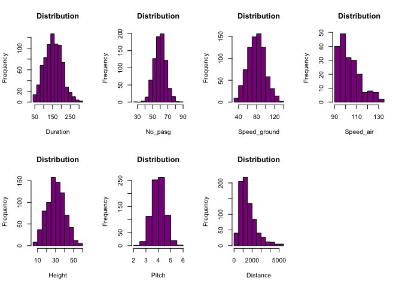
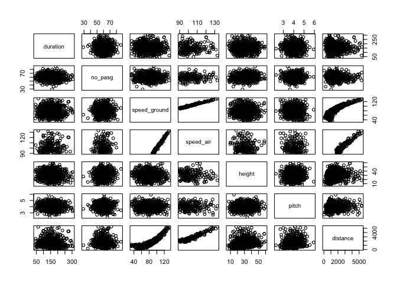
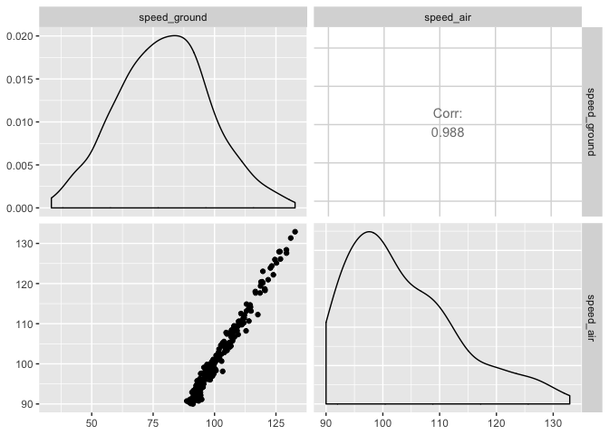
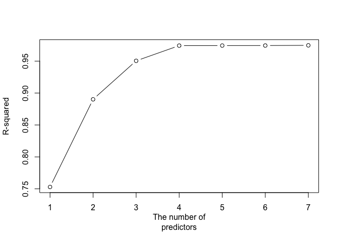
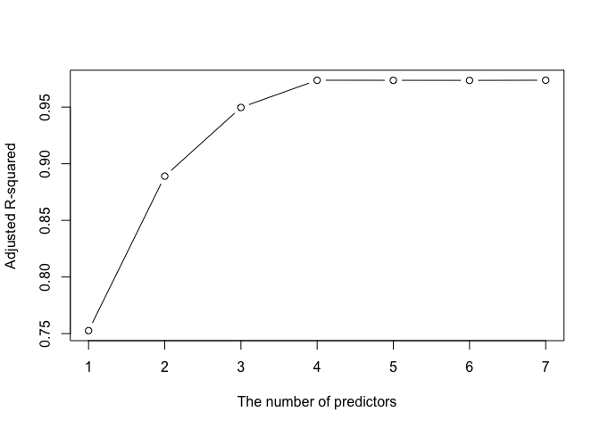
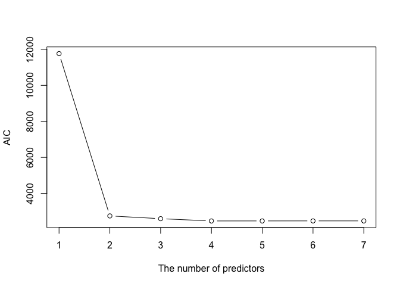

Flight Landing Distance Part 1
================

``` r
library(funModeling)
```

    ## Loading required package: Hmisc

    ## Loading required package: lattice

    ## Loading required package: survival

    ## Loading required package: Formula

    ## Loading required package: ggplot2

    ## 
    ## Attaching package: 'Hmisc'

    ## The following objects are masked from 'package:base':
    ## 
    ##     format.pval, units

    ## funModeling v.1.9.3 :)
    ## Examples and tutorials at livebook.datascienceheroes.com
    ##  / Now in Spanish: librovivodecienciadedatos.ai

``` r
library(readxl)
library(tidyverse)
```

    ## ── Attaching packages ─────────────────────────────────────────────────────── tidyverse 1.3.0 ──

    ## ✔ tibble  2.1.3     ✔ dplyr   0.8.5
    ## ✔ tidyr   1.0.2     ✔ stringr 1.4.0
    ## ✔ readr   1.3.1     ✔ forcats 0.4.0
    ## ✔ purrr   0.3.3

    ## ── Conflicts ────────────────────────────────────────────────────────── tidyverse_conflicts() ──
    ## ✖ dplyr::filter()    masks stats::filter()
    ## ✖ dplyr::lag()       masks stats::lag()
    ## ✖ dplyr::src()       masks Hmisc::src()
    ## ✖ dplyr::summarize() masks Hmisc::summarize()

``` r
library(psych)
```

    ## 
    ## Attaching package: 'psych'

    ## The following object is masked from 'package:Hmisc':
    ## 
    ##     describe

    ## The following objects are masked from 'package:ggplot2':
    ## 
    ##     %+%, alpha

``` r
library(MASS)
```

    ## 
    ## Attaching package: 'MASS'

    ## The following object is masked from 'package:dplyr':
    ## 
    ##     select

``` r
library(dplyr)
library(ggplot2)
library(plyr)
```

    ## -------------------------------------------------------------------------

    ## You have loaded plyr after dplyr - this is likely to cause problems.
    ## If you need functions from both plyr and dplyr, please load plyr first, then dplyr:
    ## library(plyr); library(dplyr)

    ## -------------------------------------------------------------------------

    ## 
    ## Attaching package: 'plyr'

    ## The following objects are masked from 'package:dplyr':
    ## 
    ##     arrange, count, desc, failwith, id, mutate, rename, summarise,
    ##     summarize

    ## The following object is masked from 'package:purrr':
    ## 
    ##     compact

    ## The following objects are masked from 'package:Hmisc':
    ## 
    ##     is.discrete, summarize

``` r
library(janitor)
```

    ## 
    ## Attaching package: 'janitor'

    ## The following objects are masked from 'package:stats':
    ## 
    ##     chisq.test, fisher.test

``` r
library(GGally)
```

    ## Registered S3 method overwritten by 'GGally':
    ##   method from   
    ##   +.gg   ggplot2

    ## 
    ## Attaching package: 'GGally'

    ## The following object is masked from 'package:dplyr':
    ## 
    ##     nasa

    ## The following object is masked from 'package:funModeling':
    ## 
    ##     range01

\#STEP 1

Reading data, c

``` r
data1 <- read_excel("FAA1.xls")
data2 <- read_excel("FAA2.xls")
```

\#STEP 2

Checking the structure of both the data sets, FAA1(data1) has 800
observations and a total of 8 variables while FAA2(data2) has 200
observations but only 7 variables, “duration” variable is missing from
FAA2.

``` r
str(data1)
```

    ## Classes 'tbl_df', 'tbl' and 'data.frame':    800 obs. of  8 variables:
    ##  $ aircraft    : chr  "boeing" "boeing" "boeing" "boeing" ...
    ##  $ duration    : num  98.5 125.7 112 196.8 90.1 ...
    ##  $ no_pasg     : num  53 69 61 56 70 55 54 57 61 56 ...
    ##  $ speed_ground: num  107.9 101.7 71.1 85.8 59.9 ...
    ##  $ speed_air   : num  109 103 NA NA NA ...
    ##  $ height      : num  27.4 27.8 18.6 30.7 32.4 ...
    ##  $ pitch       : num  4.04 4.12 4.43 3.88 4.03 ...
    ##  $ distance    : num  3370 2988 1145 1664 1050 ...

``` r
str(data2)
```

    ## Classes 'tbl_df', 'tbl' and 'data.frame':    150 obs. of  7 variables:
    ##  $ aircraft    : chr  "boeing" "boeing" "boeing" "boeing" ...
    ##  $ no_pasg     : num  53 69 61 56 70 55 54 57 61 56 ...
    ##  $ speed_ground: num  107.9 101.7 71.1 85.8 59.9 ...
    ##  $ speed_air   : num  109 103 NA NA NA ...
    ##  $ height      : num  27.4 27.8 18.6 30.7 32.4 ...
    ##  $ pitch       : num  4.04 4.12 4.43 3.88 4.03 ...
    ##  $ distance    : num  3370 2988 1145 1664 1050 ...

\#STEP 3

Merging the 2 data frames full\_join which also removes the duplicate
values.

``` r
#datac <- rbind.fill(data1, data2)
faa <- full_join(data1,data2)
```

    ## Joining, by = c("aircraft", "no_pasg", "speed_ground", "speed_air", "height", "pitch", "distance")

``` r
count(duplicated(faa))
```

    ##       x freq
    ## 1 FALSE  850

\#STEP 4

Checking the structure of "faa’, it has 850 observations and 8 variables
or columns. Summary statistics for each of the 8 variables are
    provided.

``` r
str(faa)
```

    ## Classes 'tbl_df', 'tbl' and 'data.frame':    850 obs. of  8 variables:
    ##  $ aircraft    : chr  "boeing" "boeing" "boeing" "boeing" ...
    ##  $ duration    : num  98.5 125.7 112 196.8 90.1 ...
    ##  $ no_pasg     : num  53 69 61 56 70 55 54 57 61 56 ...
    ##  $ speed_ground: num  107.9 101.7 71.1 85.8 59.9 ...
    ##  $ speed_air   : num  109 103 NA NA NA ...
    ##  $ height      : num  27.4 27.8 18.6 30.7 32.4 ...
    ##  $ pitch       : num  4.04 4.12 4.43 3.88 4.03 ...
    ##  $ distance    : num  3370 2988 1145 1664 1050 ...

``` r
summary(faa)
```

    ##    aircraft            duration         no_pasg      speed_ground   
    ##  Length:850         Min.   : 14.76   Min.   :29.0   Min.   : 27.74  
    ##  Class :character   1st Qu.:119.49   1st Qu.:55.0   1st Qu.: 65.90  
    ##  Mode  :character   Median :153.95   Median :60.0   Median : 79.64  
    ##                     Mean   :154.01   Mean   :60.1   Mean   : 79.45  
    ##                     3rd Qu.:188.91   3rd Qu.:65.0   3rd Qu.: 92.06  
    ##                     Max.   :305.62   Max.   :87.0   Max.   :141.22  
    ##                     NA's   :50                                      
    ##    speed_air          height           pitch          distance      
    ##  Min.   : 90.00   Min.   :-3.546   Min.   :2.284   Min.   :  34.08  
    ##  1st Qu.: 96.25   1st Qu.:23.314   1st Qu.:3.642   1st Qu.: 883.79  
    ##  Median :101.15   Median :30.093   Median :4.008   Median :1258.09  
    ##  Mean   :103.80   Mean   :30.144   Mean   :4.009   Mean   :1526.02  
    ##  3rd Qu.:109.40   3rd Qu.:36.993   3rd Qu.:4.377   3rd Qu.:1936.95  
    ##  Max.   :141.72   Max.   :59.946   Max.   :5.927   Max.   :6533.05  
    ##  NA's   :642

\#STEP5

1.There are 2 types of aircrafts: airbus and boeing. We may have to
observe some of the variables separately to see if there are some
differences between these aircrafts.

2.Speed\_air has 642 NA’s. We need to evaluate if we have to keep
speed\_air in our analysis or not.

3.100 duplicate values were present after merging the 2 files.

4.There are abnormal values present for different variables. For
example, the minimum value of height is negative, minimum value for
duration is only 14 minutes, some planes have landing distance\>6000
feet, speed\_ground is also above specified normal limits in some cases.

\#STEP 6

removing abnormal values

``` r
min(faa[,2], na.rm=T)
```

    ## [1] 14.76421

``` r
faa <- faa[!(faa$duration <= 40), ]
faa <- faa[!(faa$speed_ground < 30 | faa$speed_ground > 140), ]
faa <- faa[!(faa$height < 6), ]
faa <- faa[!(faa$distance > 6000), ]
```

\#STEP7

We now have 831 observations/rows and 8
    variables.

``` r
str(faa)
```

    ## Classes 'tbl_df', 'tbl' and 'data.frame':    831 obs. of  8 variables:
    ##  $ aircraft    : chr  "boeing" "boeing" "boeing" "boeing" ...
    ##  $ duration    : num  98.5 125.7 112 196.8 90.1 ...
    ##  $ no_pasg     : num  53 69 61 56 70 55 54 57 61 56 ...
    ##  $ speed_ground: num  107.9 101.7 71.1 85.8 59.9 ...
    ##  $ speed_air   : num  109 103 NA NA NA ...
    ##  $ height      : num  27.4 27.8 18.6 30.7 32.4 ...
    ##  $ pitch       : num  4.04 4.12 4.43 3.88 4.03 ...
    ##  $ distance    : num  3370 2988 1145 1664 1050 ...

``` r
dim(faa)
```

    ## [1] 831   8

``` r
summary(faa)
```

    ##    aircraft            duration         no_pasg       speed_ground   
    ##  Length:831         Min.   : 41.95   Min.   :29.00   Min.   : 33.57  
    ##  Class :character   1st Qu.:119.63   1st Qu.:55.00   1st Qu.: 66.19  
    ##  Mode  :character   Median :154.28   Median :60.00   Median : 79.79  
    ##                     Mean   :154.78   Mean   :60.08   Mean   : 79.64  
    ##                     3rd Qu.:189.66   3rd Qu.:65.00   3rd Qu.: 92.13  
    ##                     Max.   :305.62   Max.   :87.00   Max.   :132.78  
    ##                     NA's   :50       NA's   :50      NA's   :50      
    ##    speed_air          height           pitch          distance      
    ##  Min.   : 90.00   Min.   : 6.228   Min.   :2.284   Min.   :  41.72  
    ##  1st Qu.: 96.15   1st Qu.:23.594   1st Qu.:3.653   1st Qu.: 919.05  
    ##  Median :100.89   Median :30.217   Median :4.014   Median :1273.66  
    ##  Mean   :103.50   Mean   :30.455   Mean   :4.014   Mean   :1541.20  
    ##  3rd Qu.:109.42   3rd Qu.:36.988   3rd Qu.:4.382   3rd Qu.:1960.43  
    ##  Max.   :132.91   Max.   :59.946   Max.   :5.927   Max.   :5381.96  
    ##  NA's   :636      NA's   :50       NA's   :50      NA's   :50

\#STEP8

Not including aircraft since it is not numeric.

``` r
par(mfrow=c(2,4))

hist(faa$duration, main="Distribution",xlab= "Duration", col= "darkmagenta")
hist(faa$no_pasg, main="Distribution",xlab= "No_pasg", col= "darkmagenta")
hist(faa$speed_ground, main="Distribution",xlab= "Speed_ground", col= "darkmagenta")
hist(faa$speed_air, main="Distribution",xlab= "Speed_air", col= "darkmagenta")
hist(faa$height, main="Distribution",xlab= "Height", col= "darkmagenta")
hist(faa$pitch, main="Distribution",xlab= "Pitch", col= "darkmagenta")
hist(faa$distance, main="Distribution",xlab= "Distance", col= "darkmagenta")
```

<!-- -->

\#STEP9

> Speed\_air has missing 636 observations which is approximately 77%,
> since this a very large number we will be dropping this column as it
> will have negative impact on the quality of our model and predictions.

> Distribution of all variables except speed\_air and distance seem to
> follow normal distribution. Speed air and distance are skewed to
> right.

> There were 19 abnormal records, which have been removed.

> Abnirmal values make than less than 3% of our data set, hence dropping
> this observations will only improve our predictions.

\#STEP10

``` r
correlation_table(data= faa , target = "distance")
```

    ##       Variable distance
    ## 1     distance     1.00
    ## 2    speed_air     0.94
    ## 3 speed_ground     0.93
    ## 4       height     0.06
    ## 5     duration     0.05
    ## 6        pitch     0.03
    ## 7      no_pasg    -0.03

``` r
Table1<- matrix(c(1.00,"+ve",0.94,"+ve",0.93,"+ve",0.06,"-ve",0.05,"-ve",0.03,"-ve",-0.03,  "-ve"),ncol=2,byrow=TRUE)

colnames(Table1) <- c("Size of Correlation","Direction (+ve or -ve)")
rownames(Table1) <- c("distance ","speed_air","speed_ground","height", "duration","pitch","no_pasg")
Table1 <- as.table(Table1)
Table1
```

    ##              Size of Correlation Direction (+ve or -ve)
    ## distance\t   1                   +ve                   
    ## speed_air    0.94                +ve                   
    ## speed_ground 0.93                +ve                   
    ## height       0.06                -ve                   
    ## duration     0.05                -ve                   
    ## pitch        0.03                -ve                   
    ## no_pasg      -0.03               -ve

\#STEP11

Yes the values computed are consistent with the scatterplots plotted
below, with speed\_air and speed\_ground showing the maximum
correlation.

``` r
pairs(faa[,-1])
```

<!-- -->

\#STEP12

No, I did not consider airplane make as a predictor variable. Coding the
variable as
0/1

``` r
faa$aircraft <- ifelse(faa$aircraft == "boeing",0,1)
```

\#STEP13

``` r
variables <- c("aircraft", "duration","no_pasg" ,"speed_ground", "speed_air" ,"height" ,"pitch")   
coeff13 <- rep(NA,length(variables))
p_val13 <- rep(NA,length(variables))


fit_all13 <- data.frame(variables, coeff13,p_val13)

for (i in seq_along(variables))
{
fit_all13$coeff13[i] <- summary(lm(faa$distance ~  faa[[variables[i]]]))$coefficients[,1][2]
fit_all13$p_val13[i] <- summary(lm(faa$distance ~  faa[[variables[i]]]))$coefficients[,4][2]
}

table2 <- fit_all13 %>% mutate(Direction = ifelse(coeff13>0,"+","-")) %>% dplyr::select(-coeff13) %>% arrange(p_val13)
table2
```

    ##      variables       p_val13 Direction
    ## 1 speed_ground 1.060591e-238         +
    ## 2    speed_air  2.550801e-94         +
    ## 3     aircraft  7.806173e-11         -
    ## 4       height  3.710162e-03         +
    ## 5        pitch  5.503786e-02         +
    ## 6     duration  1.514002e-01         -
    ## 7      no_pasg  6.381673e-01         -

\#STEP14

``` r
#scaling
faasc <- as.data.frame(scale(faa[,-1])) 
faasc$aircraft <- faa$aircraft
faasc <- faasc %>% dplyr::select(aircraft, everything()) 
summary(faasc)
```

    ##     aircraft         duration           no_pasg          speed_ground     
    ##  Min.   :0.0000   Min.   :-2.33354   Min.   :-4.12980   Min.   :-2.43770  
    ##  1st Qu.:0.0000   1st Qu.:-0.72687   1st Qu.:-0.67523   1st Qu.:-0.71160  
    ##  Median :1.0000   Median :-0.01016   Median :-0.01089   Median : 0.00816  
    ##  Mean   :0.5045   Mean   : 0.00000   Mean   : 0.00000   Mean   : 0.00000  
    ##  3rd Qu.:1.0000   3rd Qu.: 0.72156   3rd Qu.: 0.65345   3rd Qu.: 0.66103  
    ##  Max.   :1.0000   Max.   : 3.11988   Max.   : 3.57655   Max.   : 2.81232  
    ##  NA's   :50       NA's   :50         NA's   :50         NA's   :50        
    ##    speed_air           height             pitch             distance      
    ##  Min.   :-1.3665   Min.   :-2.48751   Min.   :-3.31116   Min.   :-1.6576  
    ##  1st Qu.:-0.7443   1st Qu.:-0.70439   1st Qu.:-0.69076   1st Qu.:-0.6878  
    ##  Median :-0.2645   Median :-0.02448   Median :-0.00023   Median :-0.2958  
    ##  Mean   : 0.0000   Mean   : 0.00000   Mean   : 0.00000   Mean   : 0.0000  
    ##  3rd Qu.: 0.5987   3rd Qu.: 0.67077   3rd Qu.: 0.70480   3rd Qu.: 0.4634  
    ##  Max.   : 2.9763   Max.   : 3.02794   Max.   : 3.66150   Max.   : 4.2458  
    ##  NA's   :636       NA's   :50         NA's   :50         NA's   :50

``` r
#regression of scaled variables
coeff14 <- rep(NA,length(variables))
p_val14 <- rep(NA,length(variables))


fit_all14 <- data.frame(variables, coeff14,p_val14)

for (i in seq_along(variables))
{
  fit_all14$coeff14[i] <- summary(lm(faasc$distance ~  faasc[[variables[i]]]))$coefficients[,1][2]
  fit_all14$p_val14[i] <- summary(lm(faasc$distance ~  faasc[[variables[i]]]))$coefficients[,4][2]
}

table3 <- fit_all14 %>% mutate(Direction = ifelse(coeff14>0,"+","-")) %>% dplyr::select(-coeff14) %>% arrange(p_val14)
table3
```

    ##      variables       p_val14 Direction
    ## 1 speed_ground 1.060591e-238         +
    ## 2    speed_air  2.550801e-94         +
    ## 3     aircraft  7.806173e-11         -
    ## 4       height  3.710162e-03         +
    ## 5        pitch  5.503786e-02         +
    ## 6     duration  1.514002e-01         -
    ## 7      no_pasg  6.381673e-01         -

\#STEP15

Yes the results are consistent, most significant factors are
speed\_ground, speed\_air, aircraft, height, and
pitch.

``` r
Table0<- matrix(c(1,"speed_ground",2,"speed_air",3,"aircraft",4,"height",5,"pitch",6,"duration",7,  "no_pasg"),ncol=2,byrow=TRUE)

colnames(Table0) <- c("Rank","Predictor")
Table0 <- as.table(Table0)
Table0
```

    ##   Rank Predictor   
    ## A 1    speed_ground
    ## B 2    speed_air   
    ## C 3    aircraft    
    ## D 4    height      
    ## E 5    pitch       
    ## F 6    duration    
    ## G 7    no_pasg

\#STEP16

``` r
model1 <- lm(faa$distance ~ faa$speed_ground)
summary(model1)
```

    ## 
    ## Call:
    ## lm(formula = faa$distance ~ faa$speed_ground)
    ## 
    ## Residuals:
    ##     Min      1Q  Median      3Q     Max 
    ## -911.35 -318.91  -76.71  217.15 1779.50 
    ## 
    ## Coefficients:
    ##                    Estimate Std. Error t value Pr(>|t|)    
    ## (Intercept)      -1766.7573    69.7769  -25.32   <2e-16 ***
    ## faa$speed_ground    41.5366     0.8525   48.72   <2e-16 ***
    ## ---
    ## Signif. codes:  0 '***' 0.001 '**' 0.01 '*' 0.05 '.' 0.1 ' ' 1
    ## 
    ## Residual standard error: 449.9 on 779 degrees of freedom
    ##   (50 observations deleted due to missingness)
    ## Multiple R-squared:  0.7529, Adjusted R-squared:  0.7526 
    ## F-statistic:  2374 on 1 and 779 DF,  p-value: < 2.2e-16

``` r
model2 <- lm(faa$distance ~ faa$speed_air)
summary(model2)
```

    ## 
    ## Call:
    ## lm(formula = faa$distance ~ faa$speed_air)
    ## 
    ## Residuals:
    ##     Min      1Q  Median      3Q     Max 
    ## -783.22 -189.61    2.73  215.76  623.27 
    ## 
    ## Coefficients:
    ##                Estimate Std. Error t value Pr(>|t|)    
    ## (Intercept)   -5417.607    208.860  -25.94   <2e-16 ***
    ## faa$speed_air    79.244      2.009   39.45   <2e-16 ***
    ## ---
    ## Signif. codes:  0 '***' 0.001 '**' 0.01 '*' 0.05 '.' 0.1 ' ' 1
    ## 
    ## Residual standard error: 276.4 on 193 degrees of freedom
    ##   (636 observations deleted due to missingness)
    ## Multiple R-squared:  0.8897, Adjusted R-squared:  0.8891 
    ## F-statistic:  1556 on 1 and 193 DF,  p-value: < 2.2e-16

``` r
model3 <- lm(faa$distance ~ faa$speed_ground + faa$speed_air)
summary(model3)
```

    ## 
    ## Call:
    ## lm(formula = faa$distance ~ faa$speed_ground + faa$speed_air)
    ## 
    ## Residuals:
    ##    Min     1Q Median     3Q    Max 
    ## -820.6 -182.0    7.7  204.2  633.0 
    ## 
    ## Coefficients:
    ##                  Estimate Std. Error t value Pr(>|t|)    
    ## (Intercept)      -5425.49     209.08 -25.950  < 2e-16 ***
    ## faa$speed_ground   -12.32      12.98  -0.949    0.344    
    ## faa$speed_air       91.63      13.20   6.941 5.82e-11 ***
    ## ---
    ## Signif. codes:  0 '***' 0.001 '**' 0.01 '*' 0.05 '.' 0.1 ' ' 1
    ## 
    ## Residual standard error: 276.5 on 192 degrees of freedom
    ##   (636 observations deleted due to missingness)
    ## Multiple R-squared:  0.8902, Adjusted R-squared:  0.889 
    ## F-statistic: 778.1 on 2 and 192 DF,  p-value: < 2.2e-16

``` r
#checking correlation
ggpairs(data = faa, columns =4:5 )
```

<!-- --> regression
coefficients speed\_ground = 41.5366 speed\_air = 79.244

regression coefficients for model 2 speed\_air + speed\_ground
speed\_ground -12.32 speed\_air 91.63

We can see that the coefficient sign for speed\_ground has changed from
+ve to -ve.

We would select speed\_ground as speed\_air has close to 77% missing
values, and it has a correlation close to 1 with speed\_ground so it
won’t affect much.

\#STEP17

``` r
#models
m1 <- lm(faa$distance ~ faa$speed_ground)
m2 <- lm(faa$distance ~ faa$speed_ground+faa$speed_air)
m3 <- lm(faa$distance~faa$speed_ground+faa$speed_air+faa$aircraft)
m4 <- lm(faa$distance ~ faa$speed_ground+faa$height+faa$speed_air+faa$aircraft)
m5 <- lm(faa$distance ~ faa$speed_ground+faa$height+faa$speed_air+faa$aircraft+faa$pitch)
m6 <- lm(faa$distance ~ faa$speed_ground+faa$height+faa$speed_air+faa$aircraft+faa$pitch+faa$duration)
m7 <- lm(faa$distance ~ ., data = faa)


#rsqaured
r.sq1<-summary(m1)$ r.squared
r.sq2<-summary(m2)$ r.squared
r.sq3<-summary(m3)$ r.squared
r.sq4<-summary(m4)$ r.squared
r.sq5<-summary(m5)$ r.squared
r.sq6<-summary(m6)$ r.squared
r.sq7<-summary(m7)$ r.squared
print(c(r.sq1,r.sq2,r.sq3,r.sq4,r.sq5,r.sq6,r.sq7))
```

    ## [1] 0.7529232 0.8901776 0.9504620 0.9742864 0.9743596 0.9744314 0.9747110

``` r
#plotting
plot(c(1,2,3,4,5,6,7),c(r.sq1,r.sq2,r.sq3,r.sq4,r.sq5,r.sq6,r.sq7),type="b",ylab ="R-squared", xlab ="The number of
predictors")
```

<!-- -->

R-squared value is going up as the number of predictors are increasing,
this can mean that explanatory power of the model is going up but in
general r squared always increases with predictors irrespective of
whether it is better than model with less predictors or
not.

\#STEP18

``` r
(radj.sq1<-summary(m1)$ adj.r.squared)
```

    ## [1] 0.752606

``` r
(radj.sq2<-summary(m2)$ adj.r.squared)
```

    ## [1] 0.8890336

``` r
(radj.sq3<-summary(m3)$ adj.r.squared)
```

    ## [1] 0.9496839

``` r
(radj.sq4<-summary(m4)$ adj.r.squared)
```

    ## [1] 0.9737451

``` r
(radj.sq5<-summary(m5)$ adj.r.squared)
```

    ## [1] 0.9736813

``` r
(radj.sq6<-summary(m6)$ adj.r.squared)
```

    ## [1] 0.9736154

``` r
(radj.sq7<-summary(m7)$ adj.r.squared)
```

    ## [1] 0.9737643

``` r
plot(c(1,2,3,4,5,6,7),c(radj.sq1,radj.sq2,radj.sq3,radj.sq4,radj.sq5,radj.sq6,radj.sq7),type="b",ylab ="Adjusted R-squared", xlab ="The number of predictors")
```

<!-- --> It is quite
similar to the previous plot, but Adjusted R sq penalizes for every
addition of a
predictor.

\#STEP19

``` r
(AIC(m1))
```

    ## [1] 11762.79

``` r
(AIC(m2))
```

    ## [1] 2751.048

``` r
(AIC(m3))
```

    ## [1] 2597.804

``` r
(AIC(m4))
```

    ## [1] 2471.938

``` r
(AIC(m5))
```

    ## [1] 2473.383

``` r
(AIC(m6))
```

    ## [1] 2474.836

``` r
(AIC(m7))
```

    ## [1] 2474.692

``` r
plot(c(1,2,3,4,5,6,7),c(AIC(m1),AIC(m2),AIC(m3),AIC(m4),AIC(m5),AIC(m6),AIC(m7)),type="b",ylab ="AIC", xlab
="The number of predictors")
```

<!-- -->

Lower AIC indicates a better predictive model, we can see that model 1
which only has speed\_ground has the highest AIC and as soon as we add
speed\_air AIC comes down signiifcantly indicating a better fitting
mode.

AIC keeps reducing till model 4 and then starts to increase slightly.
Model 4 includes speed\_ground, speed\_air, height, and aircraft.

\#STEP20

considering the results from step 18 and step 19 we would go ahead and
build a predicitive model with the following variables

speed\_ground height aircraft

we will drop speed\_air as it has a lot of missing values, also the
correlation with speed\_ground is close to 1 so it wont really reduce
the effectiveness of our model.

\#STEP21

stepAIC() has given the best AIC so far as compared with AIC computed in
step 19. AIC of stepAIC() = 1919.45 our best AIC is given by m4 which is
= 2471.938

In addition to our model stepAIC() has added pitch and duration
variable.

``` r
null <- lm(faa$distance ~ 1, data = faa )
summary(null)
```

    ## 
    ## Call:
    ## lm(formula = faa$distance ~ 1, data = faa)
    ## 
    ## Residuals:
    ##     Min      1Q  Median      3Q     Max 
    ## -1499.5  -622.2  -267.5   419.2  3840.8 
    ## 
    ## Coefficients:
    ##             Estimate Std. Error t value Pr(>|t|)    
    ## (Intercept)  1541.20      32.37   47.61   <2e-16 ***
    ## ---
    ## Signif. codes:  0 '***' 0.001 '**' 0.01 '*' 0.05 '.' 0.1 ' ' 1
    ## 
    ## Residual standard error: 904.6 on 780 degrees of freedom
    ##   (50 observations deleted due to missingness)

``` r
stepmod<-stepAIC(m6, direction = "forward", trace= T)
```

    ## Start:  AIC=1919.45
    ## faa$distance ~ faa$speed_ground + faa$height + faa$speed_air + 
    ##     faa$aircraft + faa$pitch + faa$duration
