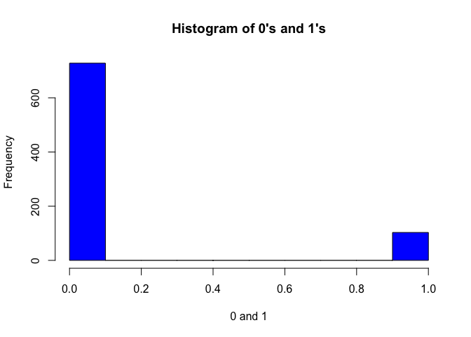
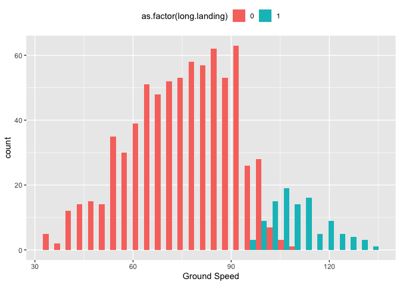
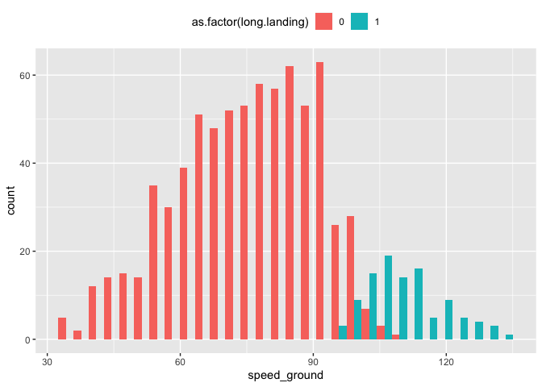
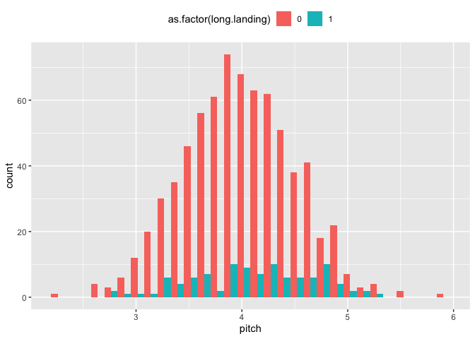
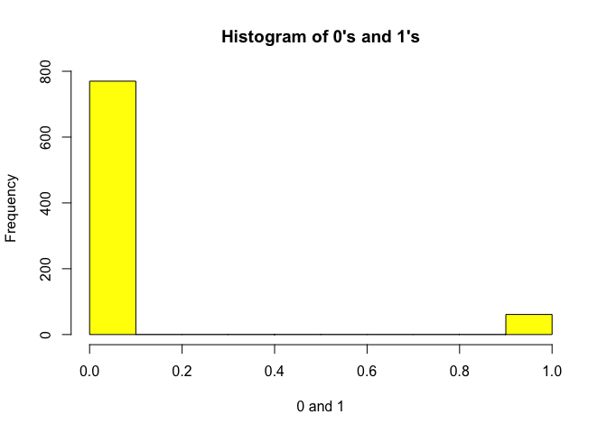
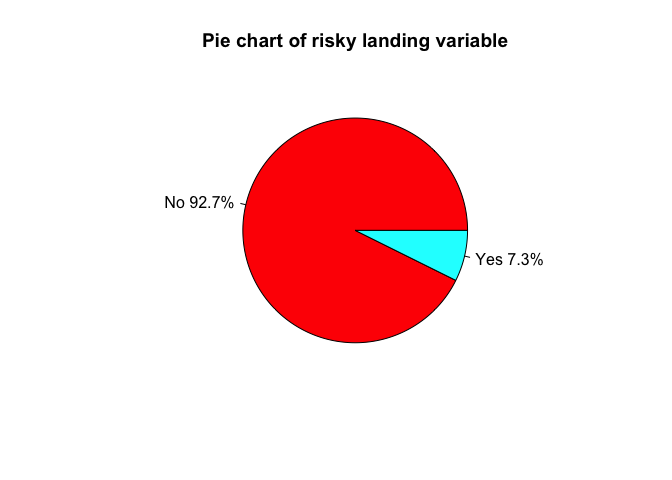

Flight Landing Distance Part 2
================

``` r
library(data.table)
library(ggplot2)
library(dplyr)
```

    ## 
    ## Attaching package: 'dplyr'

    ## The following objects are masked from 'package:data.table':
    ## 
    ##     between, first, last

    ## The following objects are masked from 'package:stats':
    ## 
    ##     filter, lag

    ## The following objects are masked from 'package:base':
    ## 
    ##     intersect, setdiff, setequal, union

``` r
library(MASS)
```

    ## 
    ## Attaching package: 'MASS'

    ## The following object is masked from 'package:dplyr':
    ## 
    ##     select

``` r
library(knitr)
library(yaml)
```

\#STEP 1

``` r
data <- read.csv("Combinedflight.csv")
str(data)
```

    ## 'data.frame':    831 obs. of  8 variables:
    ##  $ aircraft    : Factor w/ 2 levels "airbus","boeing": 2 2 2 2 2 2 2 2 2 2 ...
    ##  $ duration    : num  98.5 125.7 112 196.8 90.1 ...
    ##  $ no_pasg     : int  53 69 61 56 70 55 54 57 61 56 ...
    ##  $ speed_ground: num  107.9 101.7 71.1 85.8 59.9 ...
    ##  $ speed_air   : num  109 103 NA NA NA ...
    ##  $ height      : num  27.4 27.8 18.6 30.7 32.4 ...
    ##  $ pitch       : num  4.04 4.12 4.43 3.88 4.03 ...
    ##  $ distance    : num  3370 2988 1145 1664 1050 ...

``` r
#adding binary variables
data$long.landing<-ifelse(data$distance>2500,1,0)
data$risky.landing <- ifelse(data$distance>3000,1,0)
#discarding the continous distance column
data <- dplyr::select(data, -c(distance))
#data<-data%>%
  #select(-distance)
```

\#STEP 2

``` r
x <- data$long.landing
h <- hist(x,col="blue", xlab="0 and 1",
   main="Histogram of 0's and 1's")
```

<!-- -->

\#STEP
    3

``` r
lmod<-glm(long.landing~., family=binomial, data)
```

    ## Warning: glm.fit: fitted probabilities numerically 0 or 1 occurred

``` r
beta <- coef(lmod)
round(beta,3)
```

    ##    (Intercept) aircraftboeing       duration        no_pasg   speed_ground 
    ##       -195.872          8.766          0.000         -0.073         -0.225 
    ##      speed_air         height          pitch  risky.landing 
    ##          1.980          0.422          1.463         11.132

``` r
summary(lmod)
```

    ## 
    ## Call:
    ## glm(formula = long.landing ~ ., family = binomial, data = data)
    ## 
    ## Deviance Residuals: 
    ##      Min        1Q    Median        3Q       Max  
    ## -2.48513  -0.01382   0.00000   0.00000   1.56909  
    ## 
    ## Coefficients:
    ##                  Estimate Std. Error z value Pr(>|z|)    
    ## (Intercept)    -1.959e+02  5.627e+01  -3.481 0.000499 ***
    ## aircraftboeing  8.766e+00  2.628e+00   3.335 0.000852 ***
    ## duration        3.121e-04  1.046e-02   0.030 0.976209    
    ## no_pasg        -7.327e-02  7.015e-02  -1.044 0.296317    
    ## speed_ground   -2.247e-01  3.842e-01  -0.585 0.558636    
    ## speed_air       1.980e+00  7.098e-01   2.790 0.005277 ** 
    ## height          4.216e-01  1.431e-01   2.946 0.003221 ** 
    ## pitch           1.463e+00  1.057e+00   1.384 0.166281    
    ## risky.landing   1.113e+01  2.124e+03   0.005 0.995819    
    ## ---
    ## Signif. codes:  0 '***' 0.001 '**' 0.01 '*' 0.05 '.' 0.1 ' ' 1
    ## 
    ## (Dispersion parameter for binomial family taken to be 1)
    ## 
    ##     Null deviance: 270.199  on 194  degrees of freedom
    ## Residual deviance:  32.898  on 186  degrees of freedom
    ##   (636 observations deleted due to missingness)
    ## AIC: 50.898
    ## 
    ## Number of Fisher Scoring iterations: 20

``` r
#plotting the rank table
data.table(
                     check.names = FALSE,
                        Variable_names = c("Aircraft","speed_air","height","pitch",
                                     "no_pasg","speed_ground","duration"),
                                       Reg_coeff_size = c(8.766,1.98,0.422,1.463,-0.073,-0.225,0),
                      Odds_ratio = c(6412.471211,7.242742985,1.525008525,
                                     4.318896803,0.92960083,0.798516219,1),
        Reg_coeff_direction = c("positive","positive","positive","positive",
                                     "positive","negative","positive"),
                                                            `p-value` = c(0.009,0.005,0.003,0.167,0.296,0.558,0.98                                     )
)
```

    ##    Variable_names Reg_coeff_size   Odds_ratio Reg_coeff_direction p-value
    ## 1:       Aircraft          8.766 6412.4712110            positive   0.009
    ## 2:      speed_air          1.980    7.2427430            positive   0.005
    ## 3:         height          0.422    1.5250085            positive   0.003
    ## 4:          pitch          1.463    4.3188968            positive   0.167
    ## 5:        no_pasg         -0.073    0.9296008            positive   0.296
    ## 6:   speed_ground         -0.225    0.7985162            negative   0.558
    ## 7:       duration          0.000    1.0000000            positive   0.980

\#STEP 4 Significant factors are Aircraft, speed\_air, and height as
their p-values are
significant.

``` r
ggplot(data, aes(x=speed_ground, fill=as.factor(long.landing)))+geom_histogram(position="dodge")+theme(legend.position = "top")+(xlab("Ground Speed"))
```

    ## `stat_bin()` using `bins = 30`. Pick better value with `binwidth`.

<!-- --> The ground
speed data is skewed to right when put against long
landing

``` r
ggplot(data, aes(x=height, fill=as.factor(long.landing)))+geom_histogram(position="dodge")+theme(legend.position = "top")
```

    ## `stat_bin()` using `bins = 30`. Pick better value with `binwidth`.

<!-- -->

height data is approximately normally
distributed

``` r
ggplot(data, aes(x=speed_air, fill=as.factor(long.landing)))+geom_histogram(position="dodge")+theme(legend.position = "top")
```

    ## `stat_bin()` using `bins = 30`. Pick better value with `binwidth`.

    ## Warning: Removed 628 rows containing non-finite values (stat_bin).

<!-- --> speed\_air is
skewed to the
right

``` r
plot(data$speed_air ~ data$speed_ground, col = rep(c("red", "blue"), each = 20), pch = 10, xlab = "Speed on ground", 
    ylab = "Speed in air")
```

<!-- --> It is clear
that there is high collimearity between speed\_air and speed\_ground, we
eliminate speed\_air as it is a lot of missing values and go firther
with speed\_ground as a predictor.

Significant Factors : speed\_ground height aircraft

``` r
data<-data%>%
  mutate(aircraft=ifelse(aircraft=="airbus",0,1))
str(data)
```

    ## 'data.frame':    831 obs. of  9 variables:
    ##  $ aircraft     : num  1 1 1 1 1 1 1 1 1 1 ...
    ##  $ duration     : num  98.5 125.7 112 196.8 90.1 ...
    ##  $ no_pasg      : int  53 69 61 56 70 55 54 57 61 56 ...
    ##  $ speed_ground : num  107.9 101.7 71.1 85.8 59.9 ...
    ##  $ speed_air    : num  109 103 NA NA NA ...
    ##  $ height       : num  27.4 27.8 18.6 30.7 32.4 ...
    ##  $ pitch        : num  4.04 4.12 4.43 3.88 4.03 ...
    ##  $ long.landing : num  1 1 0 0 0 0 0 0 0 0 ...
    ##  $ risky.landing: num  1 0 0 0 0 0 0 0 0 0 ...

\#STEP5 Using only significant
predictors

``` r
fullmod<-glm(long.landing~speed_ground+height+aircraft, data, family=binomial)
```

    ## Warning: glm.fit: fitted probabilities numerically 0 or 1 occurred

``` r
summary(fullmod)
```

    ## 
    ## Call:
    ## glm(formula = long.landing ~ speed_ground + height + aircraft, 
    ##     family = binomial, data = data)
    ## 
    ## Deviance Residuals: 
    ##      Min        1Q    Median        3Q       Max  
    ## -2.43442  -0.00117   0.00000   0.00000   2.57435  
    ## 
    ## Coefficients:
    ##                Estimate Std. Error z value Pr(>|z|)    
    ## (Intercept)  -102.95437   19.22882  -5.354 8.59e-08 ***
    ## speed_ground    0.92657    0.17242   5.374 7.70e-08 ***
    ## height          0.23106    0.05959   3.877 0.000106 ***
    ## aircraft        5.04813    1.11520   4.527 5.99e-06 ***
    ## ---
    ## Signif. codes:  0 '***' 0.001 '**' 0.01 '*' 0.05 '.' 0.1 ' ' 1
    ## 
    ## (Dispersion parameter for binomial family taken to be 1)
    ## 
    ##     Null deviance: 622.778  on 830  degrees of freedom
    ## Residual deviance:  57.047  on 827  degrees of freedom
    ## AIC: 65.047
    ## 
    ## Number of Fisher Scoring iterations: 11

Here we can see that all the considered variables are significant in
terms of their p-value.

\#STEP6

``` r
#removing missing values
data1<-data%>%
  select(-speed_air)
```

    ## Error in select(., -speed_air): unused argument (-speed_air)

``` r
AIC1<- glm(long.landing ~ 1,data=data1,family=binomial)
```

    ## Error in is.data.frame(data): object 'data1' not found

``` r
AIC2 <- glm(long.landing ~ .,data=data1,family=binomial)
```

    ## Error in is.data.frame(data): object 'data1' not found

``` r
AICF<-step(AIC1,scope=list(lower=AIC1, upper=AIC2),trace=0,direction = "forward")
```

    ## Error in terms(object): object 'AIC1' not found

``` r
summary(AICF)
```

    ## Error in summary(AICF): object 'AICF' not found

We can observe from the summary of forward variable selection model that
it has chosen exactly the the same variables we found significant after
our analysis in Step 3 and Step 4. Results are
    consistent.

\#STEP7

``` r
BIC<-step(AIC1,scope=list(lower=AIC1, upper=AIC2),k=log(nrow(data1)))
```

    ## Error in terms(object): object 'AIC1' not found

``` r
summary(BIC)
```

    ## Error in object[[i]]: object of type 'closure' is not subsettable

``` r
BIC(BIC)
```

    ## Error in UseMethod("logLik"): no applicable method for 'logLik' applied to an object of class "function"

Even with the BIC we are getting the results which are consistent with
AIC in Step 6. We are getting the same 3 variables.

\#STEP8 Our best model is as follows long.landing = -102.95437 +
0.92657*speed\_ground + 5.04813*aircraft + 0.23106\*height

1.  using the table generated in Step 3 we zeroed in on 3 most
    significant variables speed\_air, aricraft, and height.
2.  We realised that speed\_air has a lot of missing values i.e close to
    74% so we decided to remove this variable.
3.  We checked the relation/collinearity of this variable with
    speed\_ground and observed that it has high collinearity so we
    replaced speed\_air with speed\_ground for better model predicitons.
4.  After this we checked our model with speed\_ground variable and
    observed that the results were consistent with model in step 3 which
    had speed\_air.
5.  AIC and BIC values provide support to our model and the lowest AIC
    value is approx 65 which suggests that our model is performing well
    with speed\_ground and in general.
6.  Table used for reference is provided in step 3.

\#STEP9

Now we will be performing the same steps for risk.landing variable

``` r
r <- data$risky.landing
hist(r,col="yellow", xlab="0 and 1",
   main="Histogram of 0's and 1's")
```

<!-- -->

\#STEP3a

``` r
lmod2<-glm(risky.landing~., family=binomial, data)
```

    ## Warning: glm.fit: fitted probabilities numerically 0 or 1 occurred

``` r
summary(lmod2)
```

    ## 
    ## Call:
    ## glm(formula = risky.landing ~ ., family = binomial, data = data)
    ## 
    ## Deviance Residuals: 
    ##      Min        1Q    Median        3Q       Max  
    ## -1.97055   0.00000   0.00000   0.00001   2.22865  
    ## 
    ## Coefficients:
    ##                Estimate Std. Error z value Pr(>|z|)  
    ## (Intercept)  -1.613e+02  3.289e+03  -0.049   0.9609  
    ## aircraft      7.217e+00  3.034e+00   2.378   0.0174 *
    ## duration      2.012e-03  1.587e-02   0.127   0.8991  
    ## no_pasg      -1.171e-01  9.731e-02  -1.203   0.2289  
    ## speed_ground -1.770e-01  5.059e-01  -0.350   0.7264  
    ## speed_air     1.615e+00  6.586e-01   2.452   0.0142 *
    ## height        4.372e-02  5.844e-02   0.748   0.4543  
    ## pitch        -1.328e+00  1.435e+00  -0.925   0.3549  
    ## long.landing  1.358e+01  3.289e+03   0.004   0.9967  
    ## ---
    ## Signif. codes:  0 '***' 0.001 '**' 0.01 '*' 0.05 '.' 0.1 ' ' 1
    ## 
    ## (Dispersion parameter for binomial family taken to be 1)
    ## 
    ##     Null deviance: 240.724  on 194  degrees of freedom
    ## Residual deviance:  22.095  on 186  degrees of freedom
    ##   (636 observations deleted due to missingness)
    ## AIC: 40.095
    ## 
    ## Number of Fisher Scoring iterations: 21

``` r
beta2 <- coef(lmod2)
round(beta2,3)
```

    ##  (Intercept)     aircraft     duration      no_pasg speed_ground 
    ##     -161.321        7.217        0.002       -0.117       -0.177 
    ##    speed_air       height        pitch long.landing 
    ##        1.615        0.044       -1.328       13.577

``` r
data.table(
                     check.names = FALSE,
                        Variable_names = c("speed_air","aircraft","height","pitch",
                                     "no_pasg","speed_ground","duration"),
  RegCoefSize = c(1.615,7.217,0.044,-1.328,-0.117,-0.177,
                                     0.002),
                      Oddsratio = c(5.027887923,1362.395737,1.044982355,
                                     0.265006745,0.889585193,0.837779785,1.002002001),
        coefdir = c("positive","positive","positive","negative",
                                     "negative","negative","positive"),
                                                            `p-value` = c(0.0142,0.0174,0.454,0.355,0.229,0.73,0.9,
                                     NA)
)
```

    ## Warning in as.data.table.list(x, keep.rownames = keep.rownames, check.names
    ## = check.names, : Item 1 has 7 rows but longest item has 8; recycled with
    ## remainder.

    ## Warning in as.data.table.list(x, keep.rownames = keep.rownames, check.names
    ## = check.names, : Item 2 has 7 rows but longest item has 8; recycled with
    ## remainder.

    ## Warning in as.data.table.list(x, keep.rownames = keep.rownames, check.names
    ## = check.names, : Item 3 has 7 rows but longest item has 8; recycled with
    ## remainder.

    ## Warning in as.data.table.list(x, keep.rownames = keep.rownames, check.names
    ## = check.names, : Item 4 has 7 rows but longest item has 8; recycled with
    ## remainder.

    ##    Variable_names RegCoefSize    Oddsratio  coefdir p-value
    ## 1:      speed_air       1.615    5.0278879 positive  0.0142
    ## 2:       aircraft       7.217 1362.3957370 positive  0.0174
    ## 3:         height       0.044    1.0449824 positive  0.4540
    ## 4:          pitch      -1.328    0.2650067 negative  0.3550
    ## 5:        no_pasg      -0.117    0.8895852 negative  0.2290
    ## 6:   speed_ground      -0.177    0.8377798 negative  0.7300
    ## 7:       duration       0.002    1.0020020 positive  0.9000
    ## 8:      speed_air       1.615    5.0278879 positive      NA

Significant factors are speed\_air, and aircraft.
\#STEP4a

``` r
ggplot(data, aes(x=speed_air, fill=as.factor(risky.landing)))+geom_histogram(position="dodge")+theme(legend.position = "top")
```

    ## `stat_bin()` using `bins = 30`. Pick better value with `binwidth`.

    ## Warning: Removed 628 rows containing non-finite values (stat_bin).

<!-- -->

\#STEP5a Using only significant predictors for our
    model

``` r
riskmod<- glm(risky.landing~speed_ground+aircraft,family=binomial, data)
```

    ## Warning: glm.fit: fitted probabilities numerically 0 or 1 occurred

``` r
summary(riskmod)
```

    ## 
    ## Call:
    ## glm(formula = risky.landing ~ speed_ground + aircraft, family = binomial, 
    ##     data = data)
    ## 
    ## Deviance Residuals: 
    ##      Min        1Q    Median        3Q       Max  
    ## -2.24398  -0.00011   0.00000   0.00000   1.61021  
    ## 
    ## Coefficients:
    ##               Estimate Std. Error z value Pr(>|z|)    
    ## (Intercept)  -102.0772    24.7751  -4.120 3.79e-05 ***
    ## speed_ground    0.9263     0.2248   4.121 3.78e-05 ***
    ## aircraft        4.0190     1.2494   3.217   0.0013 ** 
    ## ---
    ## Signif. codes:  0 '***' 0.001 '**' 0.01 '*' 0.05 '.' 0.1 ' ' 1
    ## 
    ## (Dispersion parameter for binomial family taken to be 1)
    ## 
    ##     Null deviance: 436.043  on 830  degrees of freedom
    ## Residual deviance:  40.097  on 828  degrees of freedom
    ## AIC: 46.097
    ## 
    ## Number of Fisher Scoring iterations: 12

\#STEP6a

``` r
AIC3<- glm(risky.landing ~ 1,data=data1,family=binomial)
```

    ## Error in is.data.frame(data): object 'data1' not found

``` r
AIC4 <- glm(risky.landing ~ .,data=data1,family=binomial)
```

    ## Error in is.data.frame(data): object 'data1' not found

``` r
#AIC
AICF2<-step(AIC3,scope=list(lower=AIC3, upper=AIC4),trace=0,direction = "forward")
```

    ## Error in terms(object): object 'AIC3' not found

``` r
summary(AICF2)
```

    ## Error in summary(AICF2): object 'AICF2' not found

Using BIC

``` r
BIC1 <- step(AIC3,scope=list(lower=AIC3, upper=AIC4),k=log(nrow(data)))
```

    ## Error in terms(object): object 'AIC3' not found

``` r
summary(BIC1)
```

    ## Error in summary(BIC1): object 'BIC1' not found

\#STEP10 Our best model: risky.landing=-102.0772 + 0.9263*speed\_ground
+ 4.0190*aircraft

Both AIC and BIC indicate that our first model for risky.landing which
gave significant factors as aircraft and speed\_ground is consistent
with the results of forward selection variable.

\#STEP11 1. So only aircraft and speed\_ground are signficant for
risky.landing unlike long.landing where even height was significant. 2.
AIC value is lesser by almost 20 points oin risky.landing variable
model. 3. We have a better prediction model for risky.landing rather
than for long.landing, which is better in the sense that long.landing is
not as dangerous as
risky.landing.

\#STEP12

``` r
LongLand <-glm(long.landing~aircraft+speed_ground+height, family=binomial,data1)
```

    ## Error in is.data.frame(data): object 'data1' not found

``` r
RiskyLand<-glm(risky.landing~aircraft+speed_ground, family=binomial,data1)
```

    ## Error in is.data.frame(data): object 'data1' not found

``` r
library(ROCR)
```

    ## Loading required package: gplots

    ## 
    ## Attaching package: 'gplots'

    ## The following object is masked from 'package:stats':
    ## 
    ##     lowess

``` r
pred1 <- prediction(predict(LongLand), data1$long.landing)
```

    ## Error in predict(LongLand): object 'LongLand' not found

``` r
perf1 <- performance(pred1,"tpr","fpr")
```

    ## Error in performance(pred1, "tpr", "fpr"): object 'pred1' not found

``` r
pred2 <- prediction(predict(RiskyLand),data1$risky.landing)
```

    ## Error in predict(RiskyLand): object 'RiskyLand' not found

``` r
perf2 <- performance(pred2,"tpr","fpr")
```

    ## Error in performance(pred2, "tpr", "fpr"): object 'pred2' not found

``` r
plot(perf1,col="blue", main = 'ROC Curve', xlab = "1-Specificity", ylab = "Sensitvity", sub = "Threshold = 0.5")
```

    ## Error in plot(perf1, col = "blue", main = "ROC Curve", xlab = "1-Specificity", : object 'perf1' not found

``` r
plot(perf2,col="red",add=TRUE)
```

    ## Error in plot(perf2, col = "red", add = TRUE): object 'perf2' not found

``` r
legend(0.6,0.45, c('long landing','risky landing'),lty=c(1,1),
lwd=c(2,2),col=c('blue','red'))
```

    ## Error in strwidth(legend, units = "user", cex = cex, font = text.font): plot.new has not been called yet

ROC curve is similar for both the
models

\#STEP13

``` r
new<-data.frame(aircraft=1, duration=200, no_pasg=80, speed_ground=115, speed_air=120, height=40, pitch=4)

#CI and probability
P1 <- predict(LongLand, newdata=new, type="response", se=T)
```

    ## Error in predict(LongLand, newdata = new, type = "response", se = T): object 'LongLand' not found

``` r
CI_L <- c((P1$fit-
                (1.96*P1$se.fit)),(P1$fit+(1.96*P1$se.fit)))
```

    ## Error in eval(expr, envir, enclos): object 'P1' not found

``` r
P1
```

    ## Error in eval(expr, envir, enclos): object 'P1' not found

``` r
CI_L
```

    ## Error in eval(expr, envir, enclos): object 'CI_L' not found

``` r
#CI and probability
P2 <- predict(RiskyLand, newdata=new, type="response",se=T)
```

    ## Error in predict(RiskyLand, newdata = new, type = "response", se = T): object 'RiskyLand' not found

``` r
CI_R <- c((P2$fit-
                (1.96*P2$se.fit)),(P2$fit+(1.96*P2$se.fit)))
```

    ## Error in eval(expr, envir, enclos): object 'P2' not found

``` r
P2
```

    ## Error in eval(expr, envir, enclos): object 'P2' not found

``` r
CI_R
```

    ## Error in eval(expr, envir, enclos): object 'CI_R' not found

\#STEP14

``` r
probit <- glm(risky.landing~aircraft+speed_ground, family=binomial(link = probit),data1)
```

    ## Error in is.data.frame(data): object 'data1' not found

``` r
haz <- glm(risky.landing~aircraft+speed_ground, family=binomial(link=cloglog),data1)
```

    ## Error in is.data.frame(data): object 'data1' not found

``` r
logit <- glm(risky.landing~aircraft+speed_ground, family=binomial,data1)
```

    ## Error in is.data.frame(data): object 'data1' not found

``` r
probit$aic
```

    ## Error in eval(expr, envir, enclos): object 'probit' not found

``` r
haz$aic
```

    ## Error in eval(expr, envir, enclos): object 'haz' not found

``` r
logit$aic
```

    ## Error in eval(expr, envir, enclos): object 'logit' not found

We can see AIC of probit is the best amongst the
    3.

\#STEP15

``` r
pred1 <- prediction(predict(probit), data1$risky.landing)
```

    ## Error in predict(probit): object 'probit' not found

``` r
perf1 <- performance(pred1,"tpr","fpr")
```

    ## Error in performance(pred1, "tpr", "fpr"): object 'pred1' not found

``` r
pred2 <- prediction(predict(haz),data1$risky.landing)
```

    ## Error in predict(haz): object 'haz' not found

``` r
perf2 <- performance(pred2,"tpr","fpr")
```

    ## Error in performance(pred2, "tpr", "fpr"): object 'pred2' not found

``` r
pred3 <- prediction(predict(logit),data1$risky.landing)
```

    ## Error in predict(logit): object 'logit' not found

``` r
perf3 <- performance(pred3,"tpr","fpr")
```

    ## Error in performance(pred3, "tpr", "fpr"): object 'pred3' not found

``` r
plot(perf1,col="blue", main = 'ROC Curve', xlab = "1-Specificity", ylab = "Sensitvity", sub = "Threshold = 0.5")
```

    ## Error in plot(perf1, col = "blue", main = "ROC Curve", xlab = "1-Specificity", : object 'perf1' not found

``` r
plot(perf2,col="red",add=TRUE)
```

    ## Error in plot(perf2, col = "red", add = TRUE): object 'perf2' not found

``` r
plot(perf3,col="green",add=TRUE)
```

    ## Error in plot(perf3, col = "green", add = TRUE): object 'perf3' not found

``` r
legend(0.6,0.6, c('probit','hazard','logit'),lty=c(1,1),
lwd=c(2,2),col=c('blue','red','green'))
```

    ## Error in strwidth(legend, units = "user", cex = cex, font = text.font): plot.new has not been called yet

Similar ROC
    curves

\#STEP16

``` r
log_p<- predict(logit, type = "response")
```

    ## Error in predict(logit, type = "response"): object 'logit' not found

``` r
prob_p<- predict(probit, type = "response")
```

    ## Error in predict(probit, type = "response"): object 'probit' not found

``` r
haz_p <- predict(haz, type = "response") #Hazard
```

    ## Error in predict(haz, type = "response"): object 'haz' not found

``` r
#Top 5 for logit link
head(sort(log_p, decreasing = TRUE),5)
```

    ## Error in sort(log_p, decreasing = TRUE): object 'log_p' not found

``` r
#Top 5 for probit link
head(sort(prob_p, decreasing = TRUE),5)
```

    ## Error in sort(prob_p, decreasing = TRUE): object 'prob_p' not found

``` r
#Top 5 for Hazard link
head(sort(haz_p, decreasing = TRUE),5)
```

    ## Error in sort(haz_p, decreasing = TRUE): object 'haz_p' not found

64 is common in all 3 models, while 56 in common for probit and hazrd.

\#STEP17

``` r
###Probit model

#Predicted Probability
probit_prob <- predict(probit, newdata=new, type="response",se=T)
```

    ## Error in predict(probit, newdata = new, type = "response", se = T): object 'probit' not found

``` r
#95% Confidence interval
CI_probit <- c((probit_prob$fit-(1.96*probit_prob$se.fit)),(probit_prob$fit+(1.96*probit_prob$se.fit)))
```

    ## Error in eval(expr, envir, enclos): object 'probit_prob' not found

``` r
###Hazard model
#Predicted Probability
hazard_prob <- predict(haz, newdata=new, type="response",se=T)
```

    ## Error in predict(haz, newdata = new, type = "response", se = T): object 'haz' not found

``` r
#95% Confidence interval
CI_hazard <- c((hazard_prob$fit-             (1.96*hazard_prob$se.fit)),(hazard_prob$fit+(1.96*hazard_prob$se.fit)))
```

    ## Error in eval(expr, envir, enclos): object 'hazard_prob' not found

``` r
#Comparison of 3 different link function models
data.table::data.table(
            check.names = FALSE,
                  Model = c("Logit", "Probit", "Hazard"),
  Pred_Prob = c(0.999789, 0.999, 1),
                     SE = c(5.87e-08, 3.15e-06, 2.61e-16),
               `95%.CI` = c("(0.998,1.006)", "(0.9999933,1.0000056)", "(1,1)")
)
```

    ##     Model Pred_Prob       SE                95%.CI
    ## 1:  Logit  0.999789 5.87e-08         (0.998,1.006)
    ## 2: Probit  0.999000 3.15e-06 (0.9999933,1.0000056)
    ## 3: Hazard  1.000000 2.61e-16                 (1,1)
