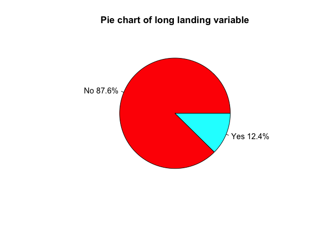
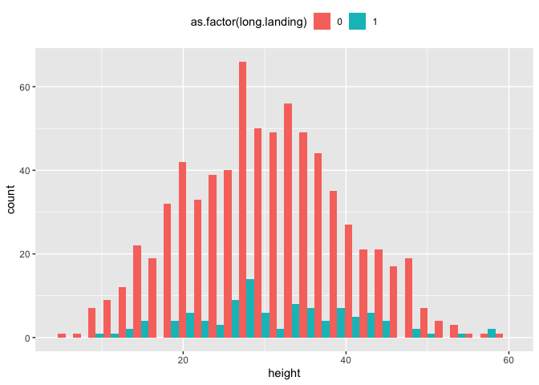

Flight Landing Distance Part 2
================

\#FLIGHT LANDING DISTANCE ANALYSIS - Logistic Regression This is in
continuation of our part1 study but here we will discard the distance
variable and work on 2 new binary variables. The dataset is the cleansed
dataset we generated during part1 after deleting abnormalities.

``` r
library(tidyverse)
library(psych)
library(dplyr)
library(funModeling)
library(ggplot2)
```

``` r
Data <- read.csv("Combinedflight.csv", header=TRUE)
str(Data)
```

    ## 'data.frame':    831 obs. of  8 variables:
    ##  $ aircraft    : Factor w/ 2 levels "airbus","boeing": 2 2 2 2 2 2 2 2 2 2 ...
    ##  $ duration    : num  98.5 125.7 112 196.8 90.1 ...
    ##  $ no_pasg     : int  53 69 61 56 70 55 54 57 61 56 ...
    ##  $ speed_ground: num  107.9 101.7 71.1 85.8 59.9 ...
    ##  $ speed_air   : num  109 103 NA NA NA ...
    ##  $ height      : num  27.4 27.8 18.6 30.7 32.4 ...
    ##  $ pitch       : num  4.04 4.12 4.43 3.88 4.03 ...
    ##  $ distance    : num  3370 2988 1145 1664 1050 ...

\#\#\#Step 1

``` r
###Adding 2 new binary variables
Data$long.landing <- ifelse(Data$distance>2500,1,0)
Data$risky.landing <- ifelse(Data$distance>3000,1,0)
#Dropping the distance column
Data <- select(Data, -c(distance))
str(Data)
```

    ## 'data.frame':    831 obs. of  9 variables:
    ##  $ aircraft     : Factor w/ 2 levels "airbus","boeing": 2 2 2 2 2 2 2 2 2 2 ...
    ##  $ duration     : num  98.5 125.7 112 196.8 90.1 ...
    ##  $ no_pasg      : int  53 69 61 56 70 55 54 57 61 56 ...
    ##  $ speed_ground : num  107.9 101.7 71.1 85.8 59.9 ...
    ##  $ speed_air    : num  109 103 NA NA NA ...
    ##  $ height       : num  27.4 27.8 18.6 30.7 32.4 ...
    ##  $ pitch        : num  4.04 4.12 4.43 3.88 4.03 ...
    ##  $ long.landing : num  1 1 0 0 0 0 0 0 0 0 ...
    ##  $ risky.landing: num  1 0 0 0 0 0 0 0 0 0 ...

The two new variables have been added and distance variable has been
dropped successfully. \#\#\#Step 2

``` r
attach(Data)
pct <- round(table(long.landing)/length(long.landing)*100,1)
labs<-c("No","Yes")
labs<-paste(labs,pct)
labs<-paste(labs,"%",sep="")
pie(table(long.landing),labels=labs,col=rainbow(length(labs)),main="Pie chart of long landing variable")
```

<!-- --> \#Step-3
Performing single-factor regression analysis

``` r
lgmod<-glm(long.landing~., family=binomial, Data)
beta.lmod <- coef(lgmod)
round(beta.lmod,3)
```

    ##    (Intercept) aircraftboeing       duration        no_pasg   speed_ground 
    ##       -195.872          8.766          0.000         -0.073         -0.225 
    ##      speed_air         height          pitch  risky.landing 
    ##          1.980          0.422          1.463         11.132

\#\#\#Table to rank the factors on the basis on regression summary
statistics

``` r
data.table::data.table(
                     check.names = FALSE,
                        Variable = c("Aircraft","speed_air","height","pitch",
                                     "no_pasg","speed_ground","duration"),
                                       SizeCoef= c(8.766,1.98,0.422,1.463,-0.073,-0.225,0),
                      OddsR = c(6412.471211,7.242742985,1.525008525,
                                     4.318896803,0.92960083,0.798516219,1),
        Direction = c("positive","positive","positive","positive",
                                     "positive","negative","positive"),
                                                            `p-value` = c(0.009,0.005,0.003,0.167,0.296,0.558,0.98                                     )
)
```

    ##        Variable SizeCoef        OddsR Direction p-value
    ## 1:     Aircraft    8.766 6412.4712110  positive   0.009
    ## 2:    speed_air    1.980    7.2427430  positive   0.005
    ## 3:       height    0.422    1.5250085  positive   0.003
    ## 4:        pitch    1.463    4.3188968  positive   0.167
    ## 5:      no_pasg   -0.073    0.9296008  positive   0.296
    ## 6: speed_ground   -0.225    0.7985162  negative   0.558
    ## 7:     duration    0.000    1.0000000  positive   0.980

\#\#\#Step4 - Visualize the
association

``` r
ggplot(Data, aes(x=speed_ground, fill=as.factor(long.landing)))+geom_histogram(position="dodge")+theme(legend.position = "top")
```

<!-- --> The data for
speed\_ground in respect to long landing = 0 is rightly
skewed.

``` r
ggplot(Data, aes(x=pitch, fill=as.factor(long.landing)))+geom_histogram(position="dodge")+theme(legend.position = "top")
```

<!-- --> The data for
pitch in respect to long landing = 0 is normally
distributed.

``` r
ggplot(Data, aes(x=height, fill=as.factor(long.landing)))+geom_histogram(position="dodge")+theme(legend.position = "top")
```

<!-- --> The data for
height in respect to long landing = 0 is normally
distributed.

``` r
ggplot(Data, aes(x=speed_air, fill=as.factor(long.landing)))+geom_histogram(position="dodge")+theme(legend.position = "top")
```

<!-- --> The data for
speed\_air in respect to long landing = 0 is rightly-skewed like
speed\_ground.

\#Checking the collinearity between speed\_ground and
speed\_air

``` r
plot(Data$speed_air ~ Data$speed_ground, col = rep(c("red", "blue"), each = 50), pch = 16, xlab = "Ground Speed", 
    ylab = "Air speed")
```

<!-- --> As we know,
speed\_air variable has around 75% of the missing values and there is a
high collinearity between speed\_ground and speed\_variable. To build a
proper model it would be wise to consider only one variable,
speed\_ground going forward. \#Important factors to consider 1.
speed\_ground 2. height 3. aircraft 4. pitch

\#\#\#Step5 Fitting the model

``` r
#Encoding the aircraft variable
Data<-Data%>%
  mutate(aircraft=ifelse(aircraft=="airbus",0,1))
str(Data)
```

    ## 'data.frame':    831 obs. of  9 variables:
    ##  $ aircraft     : num  1 1 1 1 1 1 1 1 1 1 ...
    ##  $ duration     : num  98.5 125.7 112 196.8 90.1 ...
    ##  $ no_pasg      : int  53 69 61 56 70 55 54 57 61 56 ...
    ##  $ speed_ground : num  107.9 101.7 71.1 85.8 59.9 ...
    ##  $ speed_air    : num  109 103 NA NA NA ...
    ##  $ height       : num  27.4 27.8 18.6 30.7 32.4 ...
    ##  $ pitch        : num  4.04 4.12 4.43 3.88 4.03 ...
    ##  $ long.landing : num  1 1 0 0 0 0 0 0 0 0 ...
    ##  $ risky.landing: num  1 0 0 0 0 0 0 0 0 0 ...

``` r
#Building the full model
full<-glm(long.landing~., Data, family=binomial)
summary(full)
```

    ## 
    ## Call:
    ## glm(formula = long.landing ~ ., family = binomial, data = Data)
    ## 
    ## Deviance Residuals: 
    ##      Min        1Q    Median        3Q       Max  
    ## -2.48513  -0.01382   0.00000   0.00000   1.56909  
    ## 
    ## Coefficients:
    ##                 Estimate Std. Error z value Pr(>|z|)    
    ## (Intercept)   -1.959e+02  5.627e+01  -3.481 0.000499 ***
    ## aircraft       8.766e+00  2.628e+00   3.335 0.000852 ***
    ## duration       3.121e-04  1.046e-02   0.030 0.976209    
    ## no_pasg       -7.327e-02  7.015e-02  -1.044 0.296317    
    ## speed_ground  -2.247e-01  3.842e-01  -0.585 0.558636    
    ## speed_air      1.980e+00  7.098e-01   2.790 0.005277 ** 
    ## height         4.216e-01  1.431e-01   2.946 0.003221 ** 
    ## pitch          1.463e+00  1.057e+00   1.384 0.166281    
    ## risky.landing  1.113e+01  2.124e+03   0.005 0.995819    
    ## ---
    ## Signif. codes:  0 '***' 0.001 '**' 0.01 '*' 0.05 '.' 0.1 ' ' 1
    ## 
    ## (Dispersion parameter for binomial family taken to be 1)
    ## 
    ##     Null deviance: 270.199  on 194  degrees of freedom
    ## Residual deviance:  32.898  on 186  degrees of freedom
    ##   (636 observations deleted due to missingness)
    ## AIC: 50.898
    ## 
    ## Number of Fisher Scoring iterations: 20

\#Fitting the model with the important factors

``` r
#Building the full model
final<-glm(long.landing~speed_ground+height+pitch+aircraft, Data, family=binomial)
summary(final)
```

    ## 
    ## Call:
    ## glm(formula = long.landing ~ speed_ground + height + pitch + 
    ##     aircraft, family = binomial, data = Data)
    ## 
    ## Deviance Residuals: 
    ##      Min        1Q    Median        3Q       Max  
    ## -2.20284  -0.00054   0.00000   0.00000   2.35719  
    ## 
    ## Coefficients:
    ##                Estimate Std. Error z value Pr(>|z|)    
    ## (Intercept)  -119.77598   24.41821  -4.905 9.33e-07 ***
    ## speed_ground    1.02266    0.20290   5.040 4.65e-07 ***
    ## height          0.25795    0.06861   3.760  0.00017 ***
    ## pitch           1.53751    0.84109   1.828  0.06755 .  
    ## aircraft        5.13443    1.18091   4.348 1.37e-05 ***
    ## ---
    ## Signif. codes:  0 '***' 0.001 '**' 0.01 '*' 0.05 '.' 0.1 ' ' 1
    ## 
    ## (Dispersion parameter for binomial family taken to be 1)
    ## 
    ##     Null deviance: 622.778  on 830  degrees of freedom
    ## Residual deviance:  53.204  on 826  degrees of freedom
    ## AIC: 63.204
    ## 
    ## Number of Fisher Scoring iterations: 12

We can see that all the selected predictors are significant in terms of
p-values but pitch. We will use step function to perform alternate
analysis and to determine the good fit model.

\#Step6 Forward Variable selection using AIC

``` r
#Removing speed_air column to remove missing values info
FAA.final<-Data%>%
  select(-speed_air)

null_model<- glm(long.landing ~ 1,data=FAA.final,family=binomial)
full_model <- glm(long.landing ~ .,data=FAA.final,family=binomial)
mAIC<-step(null_model,scope=list(lower=null_model, upper=full_model),trace=0,direction = "forward")
summary(mAIC)
```

    ## 
    ## Call:
    ## glm(formula = long.landing ~ speed_ground + aircraft + height + 
    ##     pitch, family = binomial, data = FAA.final)
    ## 
    ## Deviance Residuals: 
    ##      Min        1Q    Median        3Q       Max  
    ## -2.20284  -0.00054   0.00000   0.00000   2.35719  
    ## 
    ## Coefficients:
    ##                Estimate Std. Error z value Pr(>|z|)    
    ## (Intercept)  -119.77598   24.41821  -4.905 9.33e-07 ***
    ## speed_ground    1.02266    0.20290   5.040 4.65e-07 ***
    ## aircraft        5.13443    1.18091   4.348 1.37e-05 ***
    ## height          0.25795    0.06861   3.760  0.00017 ***
    ## pitch           1.53751    0.84109   1.828  0.06755 .  
    ## ---
    ## Signif. codes:  0 '***' 0.001 '**' 0.01 '*' 0.05 '.' 0.1 ' ' 1
    ## 
    ## (Dispersion parameter for binomial family taken to be 1)
    ## 
    ##     Null deviance: 622.778  on 830  degrees of freedom
    ## Residual deviance:  53.204  on 826  degrees of freedom
    ## AIC: 63.204
    ## 
    ## Number of Fisher Scoring iterations: 12

The AIC method has also chosen the model with our selected factors,
selected in Step 3 after our analysis and comparison. We have fitted the
model from only one to all the variables except speed\_air and AIC
returned us the best model with the smallest AIC value. Thus, the
results are consistent with the final decision of important factors we
analysed in step 3 to build the model.

\#Step7 Forward Variable Selection using
BIC

``` r
mBIC<-step(null_model,scope=list(lower=null_model, upper=full_model),k=log(nrow(FAA.final)))
```

    ## Start:  AIC=629.5
    ## long.landing ~ 1
    ## 
    ##                 Df Deviance    AIC
    ## + speed_ground   1   107.40 145.93
    ## + risky.landing  1   309.08 347.61
    ## + aircraft       1   583.49 622.02
    ## <none>               597.69 629.50
    ## + pitch          1   595.08 633.61
    ## + height         1   597.29 635.82
    ## + no_pasg        1   597.46 635.99
    ## + duration       1   597.46 635.99
    ## 
    ## Step:  AIC=128.92
    ## long.landing ~ speed_ground
    ## 
    ##                 Df Deviance    AIC
    ## + aircraft       1    78.16 106.40
    ## + height         1    95.06 123.30
    ## + pitch          1    97.01 125.24
    ## <none>               115.47 128.92
    ## + risky.landing  1   104.66 132.90
    ## + duration       1   107.30 135.53
    ## + no_pasg        1   107.37 135.61
    ## - speed_ground   1   622.78 629.50
    ## 
    ## Step:  AIC=104.83
    ## long.landing ~ speed_ground + aircraft
    ## 
    ##                 Df Deviance    AIC
    ## + height         1    54.40  87.79
    ## <none>                84.66 104.83
    ## + pitch          1    75.18 108.57
    ## + duration       1    76.64 110.03
    ## + risky.landing  1    77.65 111.04
    ## + no_pasg        1    77.82 111.22
    ## - aircraft       1   115.47 128.92
    ## - speed_ground   1   606.55 620.00
    ## 
    ## Step:  AIC=83.94
    ## long.landing ~ speed_ground + aircraft + height
    ## 
    ##                 Df Deviance    AIC
    ## <none>                57.05  83.94
    ## + pitch          1    51.58  87.84
    ## + risky.landing  1    53.63  89.89
    ## + duration       1    53.68  89.94
    ## + no_pasg        1    54.40  90.66
    ## - height         1    84.66 104.83
    ## - aircraft       1   100.46 120.63
    ## - speed_ground   1   605.79 625.96

``` r
summary(mBIC)
```

    ## 
    ## Call:
    ## glm(formula = long.landing ~ speed_ground + aircraft + height, 
    ##     family = binomial, data = FAA.final)
    ## 
    ## Deviance Residuals: 
    ##      Min        1Q    Median        3Q       Max  
    ## -2.43442  -0.00117   0.00000   0.00000   2.57435  
    ## 
    ## Coefficients:
    ##                Estimate Std. Error z value Pr(>|z|)    
    ## (Intercept)  -102.95437   19.22882  -5.354 8.59e-08 ***
    ## speed_ground    0.92657    0.17242   5.374 7.70e-08 ***
    ## aircraft        5.04813    1.11520   4.527 5.99e-06 ***
    ## height          0.23106    0.05959   3.877 0.000106 ***
    ## ---
    ## Signif. codes:  0 '***' 0.001 '**' 0.01 '*' 0.05 '.' 0.1 ' ' 1
    ## 
    ## (Dispersion parameter for binomial family taken to be 1)
    ## 
    ##     Null deviance: 622.778  on 830  degrees of freedom
    ## Residual deviance:  57.047  on 827  degrees of freedom
    ## AIC: 65.047
    ## 
    ## Number of Fisher Scoring iterations: 11

BIC penalizes free parameters more strongly, unlike the AIC. BIC
suggested the best(more closer to true model) with 3
factors(speed\_ground, aircraft, height) removing the additional and
less significant factor(pitch) while AIC provided the good model with
all the 4 factors.

\#Step8 Important Inferences to present 1. Best model: \#long
landing=-102.95 + 0.93*speed\_ground + 5.05*aircraft + 0.23\*height 2.
speed\_air contributing to a lot of missing values, so we based our
final analysis using speed\_ground as the most pertinent factor. 3.
Ignoring speed\_air wouldn’t affect much on our model quality as a
strong collinearity was observed between speed\_ground and speed\_air.
4. The analysis after performing forward selection using AIC and BIC has
provided us with the best model having less predictors,3 and lowest AIC,
65.047. 5. p-values are very less than 0.05; and regression coefficients
are positive depicting to be in same direction of the response variable.

\#\#Identifying important factors using the binary data of
“risky.landing” Step9 - Performing the same steps for risky.landing
variable

``` r
attach(Data)
pct <- round(table(risky.landing)/length(risky.landing)*100,1)
labs<-c("No","Yes")
labs<-paste(labs,pct)
labs<-paste(labs,"%",sep="")
pie(table(risky.landing),labels=labs,col=rainbow(length(labs)),main="Pie chart of risky landing variable")
```

<!-- -->

``` r
#Fitting the logistic model - single factor analysis
lgmod2<-glm(risky.landing~., family=binomial, Data)
beta.lmod2 <- coef(lgmod2)
round(beta.lmod2,3)
```

    ##  (Intercept)     aircraft     duration      no_pasg speed_ground 
    ##     -161.321        7.217        0.002       -0.117       -0.177 
    ##    speed_air       height        pitch long.landing 
    ##        1.615        0.044       -1.328       13.577

\#\#\#Table to rank the factors on the basis on regression summary
statistics

``` r
data.table::data.table(
                     check.names = FALSE,
                        Variable = c("speed_air","aircraft","height","pitch",
                                     "no_pasg","speed_ground","duration"),
  SizeCoef = c(1.615,7.217,0.044,-1.328,-0.117,-0.177,
                                     0.002),
                      OddsR = c(5.027887923,1362.395737,1.044982355,
                                     0.265006745,0.889585193,0.837779785,1.002002001),
        Direction = c("positive","positive","positive","negative",
                                     "negative","negative","positive"),
                                                            `p-value` = c(0.0142,0.0174,0.454,0.355,0.229,0.73,0.9,
                                     NA)
)
```

    ##        Variable SizeCoef        OddsR Direction p-value
    ## 1:    speed_air    1.615    5.0278879  positive  0.0142
    ## 2:     aircraft    7.217 1362.3957370  positive  0.0174
    ## 3:       height    0.044    1.0449824  positive  0.4540
    ## 4:        pitch   -1.328    0.2650067  negative  0.3550
    ## 5:      no_pasg   -0.117    0.8895852  negative  0.2290
    ## 6: speed_ground   -0.177    0.8377798  negative  0.7300
    ## 7:     duration    0.002    1.0020020  positive  0.9000
    ## 8:    speed_air    1.615    5.0278879  positive      NA

Visualize the
association

``` r
ggplot(Data, aes(x=speed_air, fill=as.factor(risky.landing)))+geom_histogram(position="dodge")+theme(legend.position = "top")
```

<!-- -->

``` r
ggplot(Data, aes(x=speed_ground, fill=as.factor(risky.landing)))+geom_histogram(position="dodge")+theme(legend.position = "top")
```

<!-- --> The
speed\_ground variable is normally distributed for risky.landing =
0

``` r
ggplot(Data, aes(x=height, fill=as.factor(risky.landing)))+geom_histogram(position="dodge")+theme(legend.position = "top")
```

<!-- --> \#The
significant factors till now came to be aircraft, speed\_ground and
height.

``` r
#fitting the logistic regression model
full2 <- glm(risky.landing~speed_ground+height+aircraft,family=binomial, Data)
summary(full2)
```

    ## 
    ## Call:
    ## glm(formula = risky.landing ~ speed_ground + height + aircraft, 
    ##     family = binomial, data = Data)
    ## 
    ## Deviance Residuals: 
    ##      Min        1Q    Median        3Q       Max  
    ## -2.29751  -0.00011   0.00000   0.00000   1.68834  
    ## 
    ## Coefficients:
    ##                Estimate Std. Error z value Pr(>|z|)    
    ## (Intercept)  -103.57035   25.33857  -4.087 4.36e-05 ***
    ## speed_ground    0.92971    0.22840   4.071 4.69e-05 ***
    ## height          0.03487    0.04258   0.819  0.41277    
    ## aircraft        4.11743    1.28204   3.212  0.00132 ** 
    ## ---
    ## Signif. codes:  0 '***' 0.001 '**' 0.01 '*' 0.05 '.' 0.1 ' ' 1
    ## 
    ## (Dispersion parameter for binomial family taken to be 1)
    ## 
    ##     Null deviance: 436.043  on 830  degrees of freedom
    ## Residual deviance:  39.402  on 827  degrees of freedom
    ## AIC: 47.402
    ## 
    ## Number of Fisher Scoring iterations: 12

\#Performing the forward selection using AIC and BIC criteria

``` r
null_modelR<- glm(risky.landing ~ 1,data=FAA.final,family=binomial)
full_modelR <- glm(risky.landing ~ .,data=FAA.final,family=binomial)
#AIC
AIC1<-step(null_modelR,scope=list(lower=null_modelR, upper=full_modelR),trace=0,direction = "forward")
summary(AIC1)
```

    ## 
    ## Call:
    ## glm(formula = risky.landing ~ speed_ground + aircraft + no_pasg, 
    ##     family = binomial, data = FAA.final)
    ## 
    ## Deviance Residuals: 
    ##      Min        1Q    Median        3Q       Max  
    ## -2.33913  -0.00009   0.00000   0.00000   1.87810  
    ## 
    ## Coefficients:
    ##               Estimate Std. Error z value Pr(>|z|)    
    ## (Intercept)  -99.90780   25.57993  -3.906 9.39e-05 ***
    ## speed_ground   0.94963    0.23559   4.031 5.56e-05 ***
    ## aircraft       4.64188    1.47520   3.147  0.00165 ** 
    ## no_pasg       -0.08462    0.05732  -1.476  0.13987    
    ## ---
    ## Signif. codes:  0 '***' 0.001 '**' 0.01 '*' 0.05 '.' 0.1 ' ' 1
    ## 
    ## (Dispersion parameter for binomial family taken to be 1)
    ## 
    ##     Null deviance: 436.043  on 830  degrees of freedom
    ## Residual deviance:  37.707  on 827  degrees of freedom
    ## AIC: 45.707
    ## 
    ## Number of Fisher Scoring iterations: 12

Using
BIC

``` r
BIC1 <- step(null_modelR,scope=list(lower=null_modelR, upper=full_modelR),k=log(nrow(FAA.final)))
```

    ## Start:  AIC=442.77
    ## risky.landing ~ 1
    ## 
    ##                Df Deviance    AIC
    ## + speed_ground  1    57.99  84.26
    ## + long.landing  1   134.60 160.87
    ## + aircraft      1   412.07 438.34
    ## <none>              423.22 442.77
    ## + no_pasg       1   421.18 447.45
    ## + pitch         1   421.54 447.82
    ## + duration      1   423.04 449.32
    ## + height        1   423.13 449.40
    ## 
    ## Step:  AIC=72.38
    ## risky.landing ~ speed_ground
    ## 
    ##                Df Deviance    AIC
    ## + aircraft      1    39.96  61.07
    ## <none>               58.93  72.38
    ## + pitch         1    51.63  72.74
    ## + long.landing  1    53.53  74.64
    ## + no_pasg       1    57.18  78.29
    ## + height        1    57.79  78.90
    ## + duration      1    57.95  79.06
    ## - speed_ground  1   436.04 442.77
    ## 
    ## Step:  AIC=60.26
    ## risky.landing ~ speed_ground + aircraft
    ## 
    ##                Df Deviance    AIC
    ## <none>               40.10  60.26
    ## + no_pasg       1    37.56  64.59
    ## + height        1    39.30  66.33
    ## + long.landing  1    39.46  66.49
    ## + duration      1    39.76  66.79
    ## + pitch         1    39.78  66.81
    ## - aircraft      1    58.93  72.38
    ## - speed_ground  1   422.74 436.18

``` r
summary(BIC1)
```

    ## 
    ## Call:
    ## glm(formula = risky.landing ~ speed_ground + aircraft, family = binomial, 
    ##     data = FAA.final)
    ## 
    ## Deviance Residuals: 
    ##      Min        1Q    Median        3Q       Max  
    ## -2.24398  -0.00011   0.00000   0.00000   1.61021  
    ## 
    ## Coefficients:
    ##               Estimate Std. Error z value Pr(>|z|)    
    ## (Intercept)  -102.0772    24.7751  -4.120 3.79e-05 ***
    ## speed_ground    0.9263     0.2248   4.121 3.78e-05 ***
    ## aircraft        4.0190     1.2494   3.217   0.0013 ** 
    ## ---
    ## Signif. codes:  0 '***' 0.001 '**' 0.01 '*' 0.05 '.' 0.1 ' ' 1
    ## 
    ## (Dispersion parameter for binomial family taken to be 1)
    ## 
    ##     Null deviance: 436.043  on 830  degrees of freedom
    ## Residual deviance:  40.097  on 828  degrees of freedom
    ## AIC: 46.097
    ## 
    ## Number of Fisher Scoring iterations: 12

\#Both the methods AIC and BIC have resulted in a model with 2 most
significant factors for the resposne variable, risky landing which are
speed\_ground and aircraft type.

Step10 - Important inferences to present for Risky landings variable 1.
Best model: \#risky landing=-102.08 + 0.93*speed\_ground + 4.02*aircraft
2. speed\_air contributing to a lot of missing values, so we based our
final analysis using speed\_ground as the most pertinent factor. 3. The
analysis after performing forward selection using AIC and BIC has
provided us with the same result of the best model having less
predictors,2 and lowest AIC value, 46.097. 4. p-values are very less
than 0.05; and regression coefficients are positive depicting to be in
same direction of the response variable.

\#\#\#Compare the two models built for “long.landing” and
“risky.landing” \#Step 11 1. Model to predict long landing response
variable uses less predictors than risky landing model 2. AIC value for
risky landing model is less than long landing. 3. Below is the table for
the comparison

``` r
#Step11
data.table::data.table(
    check.names = FALSE,
       `Model:` = c("No. of variables", "AIC", "Common parameters"),
   long.landing = c(3, 65.047, 2),
  risky.landing = c(2, 46.097, 2)
)
```

    ##               Model: long.landing risky.landing
    ## 1:  No. of variables        3.000         2.000
    ## 2:               AIC       65.047        46.097
    ## 3: Common parameters        2.000         2.000

\#Step12 ROC Curve

``` r
#long landing model
mlong <-glm(long.landing~aircraft+speed_ground+height, family=binomial,FAA.final)

#risky landing model
mrisky <-glm(risky.landing~aircraft+speed_ground, family=binomial,FAA.final)
```

``` r
#Model evaluation based on predictive power
library(ROCR)
pred1 <- prediction(predict(mlong), FAA.final$long.landing)
perf1 <- performance(pred1,"tpr","fpr")

pred2 <- prediction(predict(mrisky),FAA.final$risky.landing)
perf2 <- performance(pred2,"tpr","fpr")

#AUC values
unlist(slot(performance(pred1 , "auc"), "y.values"))
```

    ## [1] 0.998333

``` r
unlist(slot(performance(pred2 , "auc"), "y.values"))
```

    ## [1] 0.9986161

``` r
plot(perf1,col="blue", main = 'ROC Curve', xlab = "1-Specificity", ylab = "Sensitvity", sub = "Threshold = 0.5")

plot(perf2,col="red",add=TRUE)

legend(0.6,0.45, c('long landing','risky landing'),lty=c(1,1),
lwd=c(2,2),col=c('blue','red'))
```

<!-- --> ROC curve
for long landing and risky landing model depicts that both have almost
same AUC close to 1.

\#Step13 Predicting the
probabilities

``` r
#Boeing, duration=200, no_pasg=80, speed_ground=115, speed_air=120, height=40, pitch=4
#Aircraft is encoded 0/1, Boeing =1
values<-data.frame(aircraft=1, duration=200, no_pasg=80, speed_ground=115, speed_air=120, height=40, pitch=4)

#Long.landing(L_P) probability and 95% Confidence Interval
P1 <- predict(mlong, newdata=values, type="response", se=T)
CI_L <- c((P1$fit-
                (1.96*P1$se.fit)),(P1$fit+(1.96*P1$se.fit)))
#Risky.landing(R_P) probability and 95% Confidence Interval
P2 <- predict(mrisky, newdata=values, type="response",se=T)
CI_R <- c((P2$fit-
                (1.96*P2$se.fit)),(P2$fit+(1.96*P2$se.fit)))
```

Below is the summary:

``` r
data.table::data.table(
                         check.names = FALSE,
                         `Model:` = c("Prob", "SE", "95% CI"),
  L_P = c(1, 5.87e-08,"(0.999,1.000)"),
  R_P = c(0.99978, 0.000441, "(0.998,1.006)")
)
```

    ##    Model:           L_P           R_P
    ## 1:   Prob             1       0.99978
    ## 2:     SE      5.87e-08      0.000441
    ## 3: 95% CI (0.999,1.000) (0.998,1.006)

\#Compare models with different link functions

``` r
#Step14
mr.probit <- glm(risky.landing~aircraft+speed_ground, family=binomial(link = probit),FAA.final)
mr.cloglog <- glm(risky.landing~aircraft+speed_ground, family=binomial(link=cloglog),FAA.final)
mr.logit <- glm(risky.landing~aircraft+speed_ground, family=binomial,FAA.final)

#Table comparing AIC and Standard error for the 3 models
data.table::data.table(
  Parameters = c("AIC", "SE_ground_speed"),
      Probit = c(45.436, 0.12),
     CLogLog = c(47.443, 0.13),
       Logit = c(46.097, 0.22)
)
```

    ##         Parameters Probit CLogLog  Logit
    ## 1:             AIC 45.436  47.443 46.097
    ## 2: SE_ground_speed  0.120   0.130  0.220

It can be seen that AIC and standard error are the lowest for Probit
link function model.

\#Step15 Plotting ROC curve of different models for riskylanding
variable

``` r
#Probit model
pred_p <- prediction(predict(mr.probit), FAA.final$long.landing)
perfp1 <- performance(pred_p,"tpr","fpr")

#Hazard model
pred_c <- prediction(predict(mr.cloglog),FAA.final$risky.landing)
perfp2 <- performance(pred_c,"tpr","fpr")

#Logit model
pred_l <- prediction(predict(mr.logit),FAA.final$risky.landing)
perfp3 <- performance(pred_l,"tpr","fpr")


#AUC values
unlist(slot(performance(pred_p , "auc"), "y.values"))
```

    ## [1] 0.9964392

``` r
unlist(slot(performance(pred_c , "auc"), "y.values"))
```

    ## [1] 0.9985736

``` r
unlist(slot(performance(pred_l , "auc"), "y.values"))
```

    ## [1] 0.9986161

The Area under curve is exactly the same for all the different links’
models. \#Plotting the ROC
Curve

``` r
plot(perfp1,col="blue", main = 'ROC Curve', xlab = "1-Specificity", ylab = "Sensitvity", sub = "Threshold = 0.5")

plot(perfp2,col="red",add=TRUE)
plot(perfp3,col="green",add=TRUE)

legend(0.6,0.6, c('probit','hazard','logit'),lty=c(1,1),
lwd=c(2,2),col=c('blue','red','green'))
```

<!-- -->

\#Step16 Identification of top 5 risky landings

``` r
logit_p<- predict(mr.logit, type = "response")
probit_p<- predict(mr.probit, type = "response")
cloglog_p <- predict(mr.cloglog, type = "response") #Hazard

#Top 5 for logit link
head(sort(logit_p, decreasing = TRUE),5)
```

    ## 362 307  64 387 408 
    ##   1   1   1   1   1

``` r
#Top 5 for probit link
head(sort(probit_p, decreasing = TRUE),5)
```

    ##  56  64 134 176 179 
    ##   1   1   1   1   1

``` r
#Top 5 for Hazard link
head(sort(cloglog_p, decreasing = TRUE),5)
```

    ## 19 29 30 56 64 
    ##  1  1  1  1  1

All the 3 links model have retured different top 5 flights. Row 64 is
common in all 3 while row 56 is common among probit and hazard link
functions model.

\#Step17 Using probit and hazard models to make prediction

``` r
###Probit model

#Predicted Probability
probit_prob <- predict(mr.probit, newdata=values, type="response",se=T)
#95% Confidence interval
CI_probit <- c((probit_prob$fit-             (1.96*probit_prob$se.fit)),(probit_prob$fit+(1.96*probit_prob$se.fit)))
```

``` r
###Hazard model
#Predicted Probability
hazard_prob <- predict(mr.cloglog, newdata=values, type="response",se=T)
#95% Confidence interval
CI_hazard <- c((hazard_prob$fit-             (1.96*hazard_prob$se.fit)),(hazard_prob$fit+(1.96*hazard_prob$se.fit)))
```

``` r
#Comparison of 3 different link function models
data.table::data.table(
            check.names = FALSE,
                  Model = c("Logit", "Probit", "Hazard"),
  Pred_Prob = c(0.999789, 0.999, 1),
                     SE = c(5.87e-08, 3.15e-06, 2.61e-16),
               `95%.CI` = c("(0.998,1.006)", "(0.9999933,1.0000056)", "(1,1)")
)
```

    ##     Model Pred_Prob       SE                95%.CI
    ## 1:  Logit  0.999789 5.87e-08         (0.998,1.006)
    ## 2: Probit  0.999000 3.15e-06 (0.9999933,1.0000056)
    ## 3: Hazard  1.000000 2.61e-16                 (1,1)
