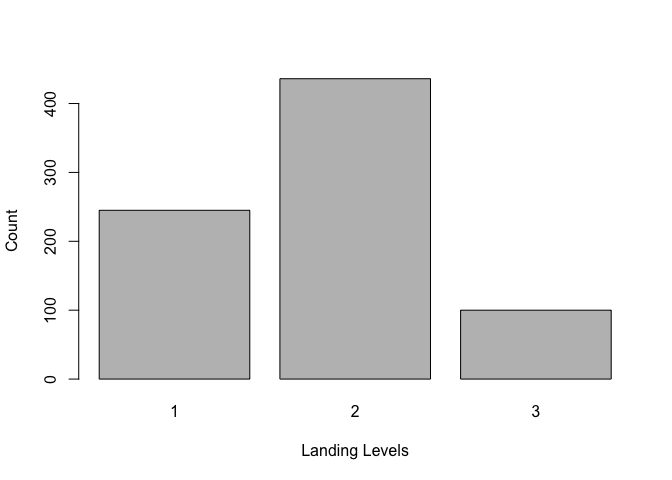
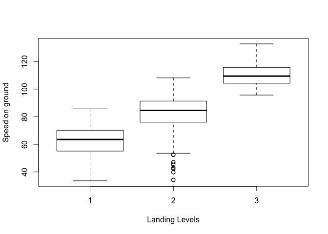
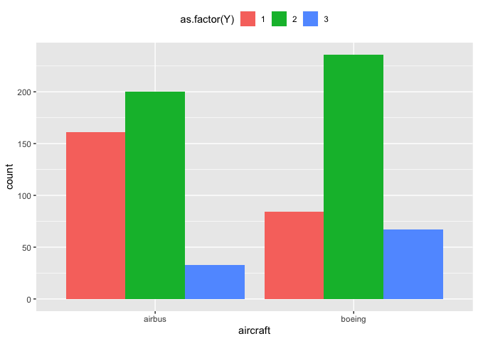

Flight Landing Distance Part 3
================

``` r
library(readxl)
library(dplyr)
```

    ## 
    ## Attaching package: 'dplyr'

    ## The following objects are masked from 'package:stats':
    ## 
    ##     filter, lag

    ## The following objects are masked from 'package:base':
    ## 
    ##     intersect, setdiff, setequal, union

``` r
library(ggplot2)
library(na.tools)
library(nnet)
library(broom)
```

STEP 1 \#\#\# Combining and cleaning the data set

``` r
data1 <- read_excel("FAA1.xls")
data2 <- read_excel("FAA2.xls")

faa <- full_join(data1,data2)
```

    ## Joining, by = c("aircraft", "no_pasg", "speed_ground", "speed_air", "height", "pitch", "distance")

``` r
#removing abnormal values
faa <- faa[!(faa$duration <= 40), ]
faa <- faa[!(faa$speed_ground < 30 | faa$speed_ground > 140), ]
faa <- faa[!(faa$height < 6), ]
faa <- faa[!(faa$distance > 6000), ]

summary(faa)
```

    ##    aircraft            duration         no_pasg       speed_ground   
    ##  Length:831         Min.   : 41.95   Min.   :29.00   Min.   : 33.57  
    ##  Class :character   1st Qu.:119.63   1st Qu.:55.00   1st Qu.: 66.19  
    ##  Mode  :character   Median :154.28   Median :60.00   Median : 79.79  
    ##                     Mean   :154.78   Mean   :60.08   Mean   : 79.64  
    ##                     3rd Qu.:189.66   3rd Qu.:65.00   3rd Qu.: 92.13  
    ##                     Max.   :305.62   Max.   :87.00   Max.   :132.78  
    ##                     NA's   :50       NA's   :50      NA's   :50      
    ##    speed_air          height           pitch          distance      
    ##  Min.   : 90.00   Min.   : 6.228   Min.   :2.284   Min.   :  41.72  
    ##  1st Qu.: 96.15   1st Qu.:23.594   1st Qu.:3.653   1st Qu.: 919.05  
    ##  Median :100.89   Median :30.217   Median :4.014   Median :1273.66  
    ##  Mean   :103.50   Mean   :30.455   Mean   :4.014   Mean   :1541.20  
    ##  3rd Qu.:109.42   3rd Qu.:36.988   3rd Qu.:4.382   3rd Qu.:1960.43  
    ##  Max.   :132.91   Max.   :59.946   Max.   :5.927   Max.   :5381.96  
    ##  NA's   :636      NA's   :50       NA's   :50      NA's   :50

STEP 2 \#\#\# Creating multinomail variable and removing continous
distance column 1. Landing Level 2 is the most common with 436
observations. 2. From the boxplots of landing levels we can safely
assume that higher the speed on ground longer is the landing distance.
3. Aircraft make doesn’t matter when it comes to landing distance.

``` r
faa1 <- faa %>% 
  mutate(Y = (ifelse(distance < 1000, 1, 
                     ifelse( distance >= 1000 & distance < 2500, 2, 3)) ))
faa1$distance <- NULL
str(faa1)
```

    ## Classes 'tbl_df', 'tbl' and 'data.frame':    831 obs. of  8 variables:
    ##  $ aircraft    : chr  "boeing" "boeing" "boeing" "boeing" ...
    ##  $ duration    : num  98.5 125.7 112 196.8 90.1 ...
    ##  $ no_pasg     : num  53 69 61 56 70 55 54 57 61 56 ...
    ##  $ speed_ground: num  107.9 101.7 71.1 85.8 59.9 ...
    ##  $ speed_air   : num  109 103 NA NA NA ...
    ##  $ height      : num  27.4 27.8 18.6 30.7 32.4 ...
    ##  $ pitch       : num  4.04 4.12 4.43 3.88 4.03 ...
    ##  $ Y           : num  3 3 2 2 2 2 1 1 2 2 ...

``` r
#Converting Y from num to factor as there is no order associated with it.
faa1$Y <- as.factor(faa1$Y)

faa1 <-  select(faa1, -speed_air ) %>% 
  na.omit()

sum(is.na(faa1))
```

    ## [1] 0

``` r
str(faa1)
```

    ## Classes 'tbl_df', 'tbl' and 'data.frame':    781 obs. of  7 variables:
    ##  $ aircraft    : chr  "boeing" "boeing" "boeing" "boeing" ...
    ##  $ duration    : num  98.5 125.7 112 196.8 90.1 ...
    ##  $ no_pasg     : num  53 69 61 56 70 55 54 57 61 56 ...
    ##  $ speed_ground: num  107.9 101.7 71.1 85.8 59.9 ...
    ##  $ height      : num  27.4 27.8 18.6 30.7 32.4 ...
    ##  $ pitch       : num  4.04 4.12 4.43 3.88 4.03 ...
    ##  $ Y           : Factor w/ 3 levels "1","2","3": 3 3 2 2 2 2 1 1 2 2 ...
    ##  - attr(*, "na.action")= 'omit' Named int  782 783 784 785 786 787 788 789 790 791 ...
    ##   ..- attr(*, "names")= chr  "782" "783" "784" "785" ...

``` r
sum(faa1$Y == 2)
```

    ## [1] 436

``` r
plot(faa1$Y, xlab = "Landing Levels", ylab = "Count")
```

<!-- -->

``` r
plot(speed_ground ~ Y, data = faa1, xlab = "Landing Levels", ylab = "Speed on ground") 
```

<!-- -->

``` r
ggplot(faa1, aes(x=aircraft, fill=as.factor(Y)))+geom_bar(position="dodge")+theme(legend.position = "top")
```

<!-- --> STEP 3 \#\#\#
Fitting multinomial model and using STEP function on that
model

### We see that duration and no\_pasg are insignificant because there is not much difference between their coefficient values and standard errors.

### STEP model gives us a model with 4 variables aircraft, speed\_ground, height, and pitch.

### p-value of pitch is not significant so we will also try a model without pitch on the model given by STEP AIC.

### Difference between AIC Values of mmodi and mmodp model is 1 unit, so we can also consider mmodp model as it has 1 less variable so is less complex than mmodi model given by STEP AIC.

``` r
#Fitting multinomial logistic model.
nmod <- multinom(Y ~ . , faa1)
```

    ## # weights:  24 (14 variable)
    ## initial  value 858.016197 
    ## iter  10 value 526.458578
    ## iter  20 value 215.771472
    ## iter  30 value 199.809707
    ## iter  40 value 199.420892
    ## iter  50 value 199.069171
    ## final  value 198.748963 
    ## converged

``` r
summary(nmod)
```

    ## Call:
    ## multinom(formula = Y ~ ., data = faa1)
    ## 
    ## Coefficients:
    ##   (Intercept) aircraftboeing     duration     no_pasg speed_ground
    ## 2    -20.0985       4.084558 -0.003528410 -0.01864576    0.2444092
    ## 3   -134.9445       9.066761  0.001835174 -0.01119463    1.2236524
    ##      height      pitch
    ## 2 0.1564499 -0.4055170
    ## 3 0.3909273  0.8773354
    ## 
    ## Std. Errors:
    ##   (Intercept) aircraftboeing    duration    no_pasg speed_ground
    ## 2  2.33164518      0.4370675 0.002795548 0.01790935   0.02045739
    ## 3  0.04012959      0.8816880 0.008101225 0.05827170   0.04073362
    ##       height     pitch
    ## 2 0.01860185 0.2798748
    ## 3 0.04903549 0.7670509
    ## 
    ## Residual Deviance: 397.4979 
    ## AIC: 425.4979

``` r
#Model selection based on AIC
mmodi <- step(nmod)
```

    ## Start:  AIC=425.5
    ## Y ~ aircraft + duration + no_pasg + speed_ground + height + pitch
    ## 
    ## trying - aircraft 
    ## # weights:  21 (12 variable)
    ## initial  value 858.016197 
    ## iter  10 value 545.368900
    ## iter  20 value 295.941472
    ## iter  30 value 290.078462
    ## iter  40 value 290.048314
    ## final  value 290.041285 
    ## converged
    ## trying - duration 
    ## # weights:  21 (12 variable)
    ## initial  value 858.016197 
    ## iter  10 value 442.022406
    ## iter  20 value 216.014947
    ## iter  30 value 202.517698
    ## iter  40 value 201.367355
    ## iter  50 value 199.797057
    ## final  value 199.797055 
    ## converged
    ## trying - no_pasg 
    ## # weights:  21 (12 variable)
    ## initial  value 858.016197 
    ## iter  10 value 556.442231
    ## iter  20 value 216.172821
    ## iter  30 value 205.178118
    ## iter  40 value 202.657413
    ## iter  50 value 199.305543
    ## iter  50 value 199.305542
    ## iter  50 value 199.305542
    ## final  value 199.305542 
    ## converged
    ## trying - speed_ground 
    ## # weights:  21 (12 variable)
    ## initial  value 858.016197 
    ## iter  10 value 718.054426
    ## final  value 706.692669 
    ## converged
    ## trying - height 
    ## # weights:  21 (12 variable)
    ## initial  value 858.016197 
    ## iter  10 value 492.283862
    ## iter  20 value 270.945535
    ## iter  30 value 262.098347
    ## iter  40 value 261.955688
    ## final  value 261.955231 
    ## converged
    ## trying - pitch 
    ## # weights:  21 (12 variable)
    ## initial  value 858.016197 
    ## iter  10 value 532.166524
    ## iter  20 value 216.120189
    ## iter  30 value 203.803925
    ## iter  40 value 202.821453
    ## final  value 201.101323 
    ## converged
    ##                Df       AIC
    ## - no_pasg      12  422.6111
    ## - duration     12  423.5941
    ## <none>         14  425.4979
    ## - pitch        12  426.2026
    ## - height       12  547.9105
    ## - aircraft     12  604.0826
    ## - speed_ground 12 1437.3853
    ## # weights:  21 (12 variable)
    ## initial  value 858.016197 
    ## iter  10 value 556.442231
    ## iter  20 value 216.172821
    ## iter  30 value 205.178118
    ## iter  40 value 202.657413
    ## iter  50 value 199.305543
    ## iter  50 value 199.305542
    ## iter  50 value 199.305542
    ## final  value 199.305542 
    ## converged
    ## 
    ## Step:  AIC=422.61
    ## Y ~ aircraft + duration + speed_ground + height + pitch
    ## 
    ## trying - aircraft 
    ## # weights:  18 (10 variable)
    ## initial  value 858.016197 
    ## iter  10 value 452.421243
    ## iter  20 value 292.613379
    ## iter  30 value 290.741685
    ## iter  40 value 290.544088
    ## iter  40 value 290.544086
    ## iter  40 value 290.544086
    ## final  value 290.544086 
    ## converged
    ## trying - duration 
    ## # weights:  18 (10 variable)
    ## initial  value 858.016197 
    ## iter  10 value 372.886847
    ## iter  20 value 213.928768
    ## iter  30 value 206.005853
    ## iter  40 value 200.349723
    ## final  value 200.343195 
    ## converged
    ## trying - speed_ground 
    ## # weights:  18 (10 variable)
    ## initial  value 858.016197 
    ## iter  10 value 710.458487
    ## final  value 706.888337 
    ## converged
    ## trying - height 
    ## # weights:  18 (10 variable)
    ## initial  value 858.016197 
    ## iter  10 value 450.914064
    ## iter  20 value 266.662455
    ## iter  30 value 262.711038
    ## iter  40 value 262.498106
    ## final  value 262.498065 
    ## converged
    ## trying - pitch 
    ## # weights:  18 (10 variable)
    ## initial  value 858.016197 
    ## iter  10 value 427.219475
    ## iter  20 value 214.209146
    ## iter  30 value 204.547146
    ## iter  40 value 201.649746
    ## final  value 201.649514 
    ## converged
    ##                Df       AIC
    ## - duration     10  420.6864
    ## <none>         12  422.6111
    ## - pitch        10  423.2990
    ## - height       10  544.9961
    ## - aircraft     10  601.0882
    ## - speed_ground 10 1433.7767
    ## # weights:  18 (10 variable)
    ## initial  value 858.016197 
    ## iter  10 value 372.886847
    ## iter  20 value 213.928768
    ## iter  30 value 206.005853
    ## iter  40 value 200.349723
    ## final  value 200.343195 
    ## converged
    ## 
    ## Step:  AIC=420.69
    ## Y ~ aircraft + speed_ground + height + pitch
    ## 
    ## trying - aircraft 
    ## # weights:  15 (8 variable)
    ## initial  value 858.016197 
    ## iter  10 value 356.745981
    ## iter  20 value 292.871111
    ## iter  30 value 291.902386
    ## final  value 291.769393 
    ## converged
    ## trying - speed_ground 
    ## # weights:  15 (8 variable)
    ## initial  value 858.016197 
    ## iter  10 value 710.304741
    ## final  value 709.523834 
    ## converged
    ## trying - height 
    ## # weights:  15 (8 variable)
    ## initial  value 858.016197 
    ## iter  10 value 319.272546
    ## iter  20 value 266.506649
    ## iter  30 value 264.383513
    ## final  value 264.306283 
    ## converged
    ## trying - pitch 
    ## # weights:  15 (8 variable)
    ## initial  value 858.016197 
    ## iter  10 value 343.608971
    ## iter  20 value 217.398794
    ## iter  30 value 206.070476
    ## iter  40 value 202.780265
    ## iter  50 value 202.779947
    ## final  value 202.779912 
    ## converged
    ##                Df       AIC
    ## <none>         10  420.6864
    ## - pitch         8  421.5598
    ## - height        8  544.6126
    ## - aircraft      8  599.5388
    ## - speed_ground  8 1435.0477

``` r
summary(mmodi)
```

    ## Call:
    ## multinom(formula = Y ~ aircraft + speed_ground + height + pitch, 
    ##     data = faa1)
    ## 
    ## Coefficients:
    ##   (Intercept) aircraftboeing speed_ground    height      pitch
    ## 2   -21.67806       4.065194    0.2431976 0.1557486 -0.3987472
    ## 3  -135.02763       8.988756    1.2159693 0.3977880  0.9396833
    ## 
    ## Std. Errors:
    ##   (Intercept) aircraftboeing speed_ground     height     pitch
    ## 2  2.09113433      0.4340363   0.02026387 0.01856171 0.2793028
    ## 3  0.03719281      0.8697689   0.02874032 0.04079031 0.7484298
    ## 
    ## Residual Deviance: 400.6864 
    ## AIC: 420.6864

``` r
(Table <- tidy(mmodi))
```

    ## # A tibble: 10 x 6
    ##    y.level term           estimate std.error statistic  p.value
    ##    <chr>   <chr>             <dbl>     <dbl>     <dbl>    <dbl>
    ##  1 2       (Intercept)    3.85e-10    2.09      -10.4  3.52e-25
    ##  2 2       aircraftboeing 5.83e+ 1    0.434       9.37 7.53e-21
    ##  3 2       speed_ground   1.28e+ 0    0.0203     12.0  3.49e-33
    ##  4 2       height         1.17e+ 0    0.0186      8.39 4.83e-17
    ##  5 2       pitch          6.71e- 1    0.279      -1.43 1.53e- 1
    ##  6 3       (Intercept)    2.28e-59    0.0372  -3630.   0.      
    ##  7 3       aircraftboeing 8.01e+ 3    0.870      10.3  4.91e-25
    ##  8 3       speed_ground   3.37e+ 0    0.0287     42.3  0.      
    ##  9 3       height         1.49e+ 0    0.0408      9.75 1.81e-22
    ## 10 3       pitch          2.56e+ 0    0.748       1.26 2.09e- 1

``` r
mmodp <- multinom(Y ~ aircraft + speed_ground +height   , faa1)
```

    ## # weights:  15 (8 variable)
    ## initial  value 858.016197 
    ## iter  10 value 343.608971
    ## iter  20 value 217.398794
    ## iter  30 value 206.070476
    ## iter  40 value 202.780265
    ## iter  50 value 202.779947
    ## final  value 202.779912 
    ## converged

``` r
AIC(mmodp)
```

    ## [1] 421.5598

``` r
summary(mmodp)
```

    ## Call:
    ## multinom(formula = Y ~ aircraft + speed_ground + height, data = faa1)
    ## 
    ## Coefficients:
    ##   (Intercept) aircraftboeing speed_ground    height
    ## 2   -22.95653       3.885287    0.2411423 0.1523806
    ## 3  -121.77952       8.794980    1.1302083 0.3728238
    ## 
    ## Std. Errors:
    ##   (Intercept) aircraftboeing speed_ground     height
    ## 2  1.92120914      0.4076498   0.01994949 0.01823184
    ## 3  0.04758712      0.7709708   0.01309965 0.03744216
    ## 
    ## Residual Deviance: 405.5598 
    ## AIC: 421.5598

STEP 4 \#\#\# Comparing the models

1.  Deviance is 3.19, higher number indicates that mmodi model has a
    better fit than nmod model.

2.  Difference between degrees of freedom is 4 which indicates that 2
    variables were dropped from the full model.

3.  Chi Square test gives a p-value of .52 which means we cannot reject
    the null hypothesis that there is a significant difference between 2
    models, hence we go ahead with the smaller/less complex
    model(mmodi).

4.  We will also compare the model without pitch (mmodp) with our full
    model.

<!-- end list -->

``` r
deviance(mmodi) - deviance(nmod)
```

    ## [1] 3.188465

``` r
nmod$edf - mmodi$edf
```

    ## [1] 4

``` r
pchisq(deviance(mmodi) - deviance(nmod),nmod$edf - mmodi$edf, lower = F)
```

    ## [1] 0.526796

``` r
table1 <- data.frame ("Model" = c("Full Model","Step-AIC","Difference")
,"Deviance " = c(deviance(nmod) , deviance(mmodi), deviance(mmodi)-
deviance(nmod)) ,"EDF" = c( mmodi$edf , nmod$edf, nmod$edf-mmodi$edf))
table1
```

    ##        Model  Deviance. EDF
    ## 1 Full Model 397.497925  10
    ## 2   Step-AIC 400.686390  14
    ## 3 Difference   3.188465   4

``` r
#without pitch comparison
deviance(mmodp) - deviance(nmod)
```

    ## [1] 8.061899

``` r
nmod$edf - mmodp$edf
```

    ## [1] 6

``` r
pchisq(deviance(mmodp) - deviance(nmod),nmod$edf - mmodp$edf, lower = F)
```

    ## [1] 0.2336034

``` r
table2 <- data.frame ("Model" = c("Full Model","Without Pitch","Difference")
,"Deviance " = c(deviance(nmod) , deviance(mmodp), deviance(mmodp)-
deviance(nmod)) ,"EDF" = c( mmodp$edf , nmod$edf, nmod$edf-mmodp$edf))
table2
```

    ##           Model  Deviance. EDF
    ## 1    Full Model 397.497925   8
    ## 2 Without Pitch 405.559824  14
    ## 3    Difference   8.061899   6

Deviance difference is much higher for model without pitch, so can
assume that it is performing better.

STEP 5 \#\#\# Prediction

``` r
#Prediction of model with Pitch included.
xtabs(~predict(mmodi)+faa1$Y)
```

    ##               faa1$Y
    ## predict(mmodi)   1   2   3
    ##              1 207  31   0
    ##              2  38 400   6
    ##              3   0   5  94

``` r
#Prediction of model with Pitch excluded.
xtabs(~predict(mmodp)+faa1$Y)
```

    ##               faa1$Y
    ## predict(mmodp)   1   2   3
    ##              1 210  30   0
    ##              2  35 402   6
    ##              3   0   4  94

We can see that in total 80 values have been wrongly predicted by our
model which includes pitch, 38 Y-1 values are classified as 2, 31 Y-2
values are classified as 1 and 5 Y-2 values are classified as 3, while
only 6 Y-3 values are classified as 2.

We can see that in total 75 values have been wrongly predicted by our
model which does not include pitch, 35 Y-1 values are classified as 2,
30 Y-2 values are classified as 1 and 4 Y-2 values are classified as 3,
while only 6 Y-3 values are classified as 2.

So the misclassification rate is lesser in model without pitch, hence we
select mmodp model as our final model.

### FINAL REPORT

### Final Model

### Y ~ aircraft + speed\_ground + height

### Final table - Confusion Matrix

``` r
xtabs(~predict(mmodp)+faa1$Y)
```

    ##               faa1$Y
    ## predict(mmodp)   1   2   3
    ##              1 210  30   0
    ##              2  35 402   6
    ##              3   0   4  94

### Final Figures

``` r
plot(faa1$Y, xlab = "Landing Levels", ylab = "Count")
```

<!-- -->

``` r
plot(speed_ground ~ Y, data = faa1, xlab = "Landing Levels", ylab = "Speed on ground") 
```

<!-- -->

  - We can see that in total 75 values have been wrongly predicted by
    our model which does not include pitch, 35 Y-1 values are classified
    as 2, 30 Y-2 values are classified as 1 and 4 Y-2 values are
    classified as 3, while only 6 Y-3 values are classified as 2.

  - Misclassification rate of our model is less than 10%.

  - Model is easier to understand and interpret as there are only 3 risk
    factors.

  - Landing Level 2 is the most common with 436 observations.

  - From the boxplots of landing levels we can safely assume that higher
    the speed on ground longer the landing
distance.

### Question 2

### We will be using Poisson distrubution as number of passenger is a positive integer count data.

``` r
posmod <- glm(no_pasg ~ .,family = poisson, data = faa1)
summary(posmod)
```

    ## 
    ## Call:
    ## glm(formula = no_pasg ~ ., family = poisson, data = faa1)
    ## 
    ## Deviance Residuals: 
    ##     Min       1Q   Median       3Q      Max  
    ## -4.3892  -0.6593   0.0208   0.6329   3.1660  
    ## 
    ## Coefficients:
    ##                  Estimate Std. Error z value Pr(>|z|)    
    ## (Intercept)     4.085e+00  5.483e-02  74.507   <2e-16 ***
    ## aircraftboeing -2.257e-03  1.089e-02  -0.207    0.836    
    ## duration       -1.030e-04  9.606e-05  -1.072    0.284    
    ## speed_ground    3.286e-04  4.472e-04   0.735    0.462    
    ## height          6.328e-04  5.045e-04   1.254    0.210    
    ## pitch          -1.931e-03  9.520e-03  -0.203    0.839    
    ## Y2             -1.208e-02  1.489e-02  -0.812    0.417    
    ## Y3             -2.599e-02  2.821e-02  -0.921    0.357    
    ## ---
    ## Signif. codes:  0 '***' 0.001 '**' 0.01 '*' 0.05 '.' 0.1 ' ' 1
    ## 
    ## (Dispersion parameter for poisson family taken to be 1)
    ## 
    ##     Null deviance: 742.75  on 780  degrees of freedom
    ## Residual deviance: 739.21  on 773  degrees of freedom
    ## AIC: 5385.2
    ## 
    ## Number of Fisher Scoring iterations: 4

### None of the variables have a significant p-value, hence this model will not be suitable for predicting the number of passengers.

### Using Step AIC

``` r
step(posmod)
```

    ## Start:  AIC=5385.23
    ## no_pasg ~ aircraft + duration + speed_ground + height + pitch + 
    ##     Y
    ## 
    ##                Df Deviance    AIC
    ## - Y             2   740.08 5382.1
    ## - pitch         1   739.25 5383.3
    ## - aircraft      1   739.25 5383.3
    ## - speed_ground  1   739.75 5383.8
    ## - duration      1   740.36 5384.4
    ## - height        1   740.78 5384.8
    ## <none>              739.21 5385.2
    ## 
    ## Step:  AIC=5382.11
    ## no_pasg ~ aircraft + duration + speed_ground + height + pitch
    ## 
    ##                Df Deviance    AIC
    ## - speed_ground  1   740.09 5380.1
    ## - pitch         1   740.13 5380.2
    ## - aircraft      1   740.50 5380.5
    ## - height        1   741.11 5381.1
    ## - duration      1   741.17 5381.2
    ## <none>              740.08 5382.1
    ## 
    ## Step:  AIC=5380.12
    ## no_pasg ~ aircraft + duration + height + pitch
    ## 
    ##            Df Deviance    AIC
    ## - pitch     1   740.13 5378.2
    ## - aircraft  1   740.51 5378.5
    ## - height    1   741.13 5379.2
    ## - duration  1   741.17 5379.2
    ## <none>          740.09 5380.1
    ## 
    ## Step:  AIC=5378.16
    ## no_pasg ~ aircraft + duration + height
    ## 
    ##            Df Deviance    AIC
    ## - aircraft  1   740.73 5376.8
    ## - height    1   741.16 5377.2
    ## - duration  1   741.20 5377.2
    ## <none>          740.13 5378.2
    ## 
    ## Step:  AIC=5376.76
    ## no_pasg ~ duration + height
    ## 
    ##            Df Deviance    AIC
    ## - duration  1   741.73 5375.8
    ## - height    1   741.78 5375.8
    ## <none>          740.73 5376.8
    ## 
    ## Step:  AIC=5375.76
    ## no_pasg ~ height
    ## 
    ##          Df Deviance    AIC
    ## - height  1   742.75 5374.8
    ## <none>        741.73 5375.8
    ## 
    ## Step:  AIC=5374.78
    ## no_pasg ~ 1

    ## 
    ## Call:  glm(formula = no_pasg ~ 1, family = poisson, data = faa1)
    ## 
    ## Coefficients:
    ## (Intercept)  
    ##       4.096  
    ## 
    ## Degrees of Freedom: 780 Total (i.e. Null);  780 Residual
    ## Null Deviance:       742.8 
    ## Residual Deviance: 742.8     AIC: 5375

``` r
drop1(posmod,test="Chisq")
```

    ## Single term deletions
    ## 
    ## Model:
    ## no_pasg ~ aircraft + duration + speed_ground + height + pitch + 
    ##     Y
    ##              Df Deviance    AIC     LRT Pr(>Chi)
    ## <none>            739.21 5385.2                 
    ## aircraft      1   739.25 5383.3 0.04298   0.8358
    ## duration      1   740.36 5384.4 1.15027   0.2835
    ## speed_ground  1   739.75 5383.8 0.54040   0.4623
    ## height        1   740.78 5384.8 1.57294   0.2098
    ## pitch         1   739.25 5383.3 0.04113   0.8393
    ## Y             2   740.08 5382.1 0.87769   0.6448

### None of the variables have a significant p-value, so we are unable to get a model to predict number of passengers using STEP.

### There is no significant variable in our dataset to predict the number of passengers.
